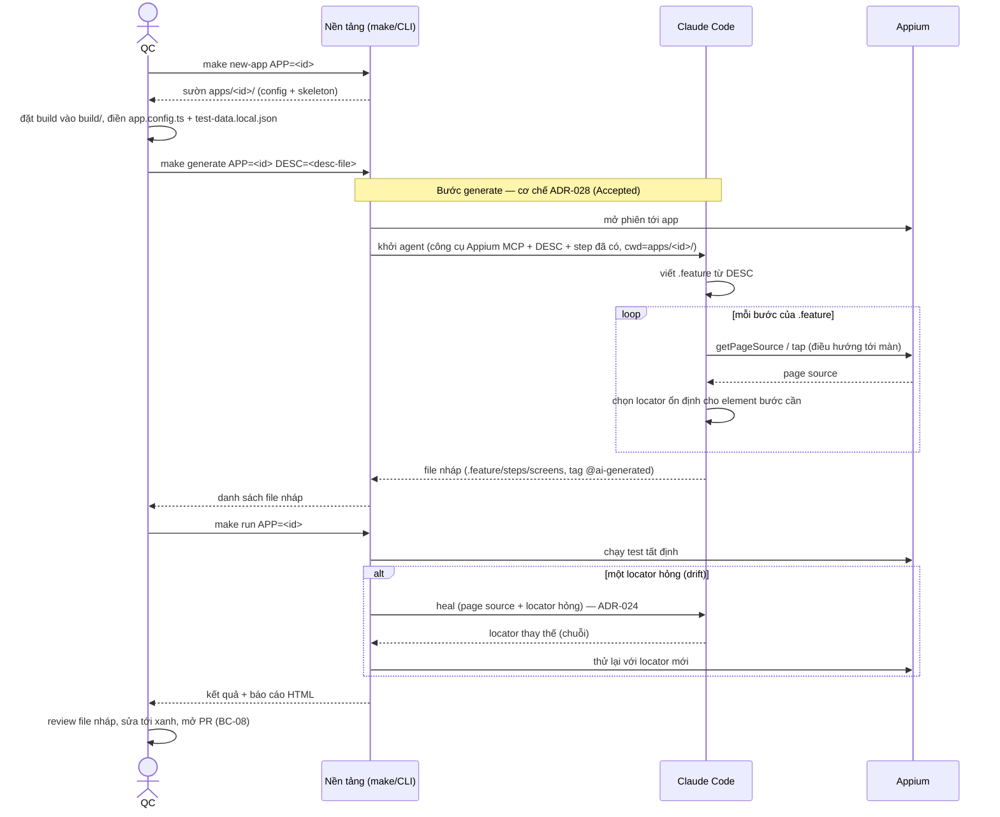

# Quy trình đưa app vào & tạo test (App Onboarding & Test Authoring Workflow)

Tài liệu quy trình có thẩm quyền cho việc đưa một app mới vào `aimtap` và tạo test cho nó — luồng end-to-end giữa bốn tác nhân: **QC** (người), **Nền tảng** (các target `make`/CLI), **AI** (Claude Code), **Appium/thiết bị**. Tài liệu này định nghĩa *quy trình* và trỏ từng bước tới quyết định thiết kế (ADR) chi phối nó; cơ chế chi tiết của mỗi bước nằm trong ADR/sequence-diagram tương ứng, không lặp lại ở đây.

Team Lead đọc tài liệu này (cùng use-case của BA) để chẻ ticket. `onboarding-a-new-app.md` là **hướng dẫn thao tác dẫn xuất** từ quy trình này, dành cho QC đọc-làm-theo.

> **Trạng thái:** bước generate bằng AI khám phá app (bước 4 dưới) theo **ADR-028 (Accepted, 2026-08-22)**; use-case đã được BA re-settle (UC-203/US-206/FR-GEN-01/BR-211). Thiết kế chi tiết đã đồng bộ (`phase-2/component-design.md`, `interface-spec.md`, `sequence-diagrams.md §2`). Còn lại: Team Lead re-ticket US-8.x (lệnh `generate` đã merge đang nhận `--page-source`).

## Tác nhân
- **QC (người):** đưa đầu vào (build, DESC, dữ liệu test), review, chạy tới xanh, mở PR.
- **Nền tảng:** các target `make` (`new-app`, `generate`, `run`, `report`) + điểm kiểm soát (thư mục ghi giới hạn, cổng chất lượng).
- **AI (Claude Code):** viết `.feature`, khám phá app lấy locator, viết code, heal (ADR-025 seam `CodeAgent`).
- **Appium/thiết bị:** phiên điều khiển app.

## Bản đồ pha → tác nhân → ADR/US

| Pha | Tác nhân chính | Cơ chế (ADR) | User story (BA) |
|---|---|---|---|
| Setup máy (một lần) | QC + Nền tảng | ADR-026 (token + setup/doctor) | US-6.x |
| Dựng sườn app | Nền tảng (`make new-app`) | — (code tất định) | US-6.5 (TICKET-047) |
| Đặt build + điền config/dữ liệu | QC | ADR-009 (dữ liệu/bí mật theo app) | US-6.x |
| Sinh test bằng AI khám phá | AI + Nền tảng + Appium | **ADR-028 (Accepted)** + ADR-025 (seam) | US-8.x |
| Chạy test (tất định) + heal khi drift | Nền tảng + Appium (+ AI khi heal) | ADR-024 (heal), ADR-013/018 (run) | US-7.x |
| Review + PR | QC | BC-08 (người duyệt qua PR) | US-8.3 |

## Sequence: đưa app vào & tạo một test (giả định máy đã setup)

## Ghi chú điểm thất bại
- **Generate (ADR-028):** AI không khả dụng (tắt/thiếu CLI-token/timeout) → nền tảng báo, không sinh file, không hỏng lượt (BR-208); QC soạn tay như Phase 1. **AI khám phá không đi hết kịch bản (kẹt màn / không tìm ra đường — UC-203 E3)** → không sinh lần này; QC chỉnh DESC + sinh lại, hoặc soạn tay. AI ghi sai file ngoài `apps/<id>/` bị chặn bởi thư mục làm việc giới hạn. File nháp sai chuẩn bị bắt ở cổng chất lượng + review (US-8.3).
- **Lộ dữ liệu khi khám phá:** phiên khám phá gửi AI nội dung mọi màn đi qua + dùng dữ liệu test (kể cả nhánh bí mật) để tiến bước — bề mặt rộng hơn heal/Phase 1, PO chấp nhận cho Phase 2 (`business/phase-2/srs.md §3`, BR-211).
- **Chạy + heal (ADR-024):** heal thất bại (không khả dụng/không tìm được locator) → bước hỏng như bình thường, lượt chạy không dừng; locator đúng chỉ persist qua PR người duyệt.
- **Điểm kiểm soát:** mọi đầu ra AI là **nháp**; an toàn đến từ người review + `make run` tới xanh trước merge, không từ việc trói AI.

## Quan hệ tài liệu
- Cơ chế generate agentic: `adr/adr-028.md` (Accepted) — kèm ví dụ luồng cụ thể.
- Cơ chế heal: `adr/adr-024.md`; seam gọi AI: `adr/adr-025.md`.
- Nội bộ chi tiết từng luồng AI: `phase-2/sequence-diagrams.md`.
- Hướng dẫn thao tác cho QC (dẫn xuất từ tài liệu này): `../onboarding-a-new-app.md`.
</content>
