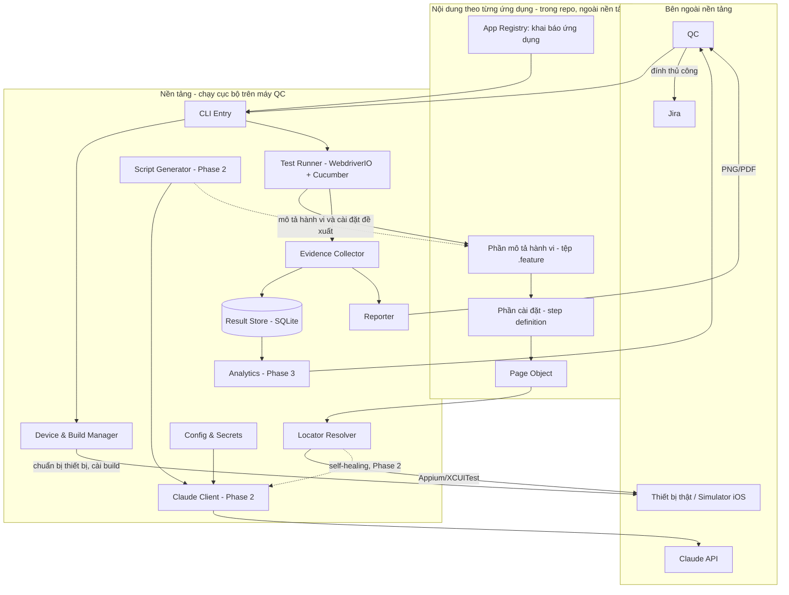

# North Star Architecture

Bức tranh kiến trúc tổng thể của nền tảng, ở mức module và ranh giới giữa chúng. Thiết kế chi tiết bên trong từng module thuộc `docs/architecture/phase-{N}/`.

---

## 1. High-level Architecture Diagram



Diagram này được cập nhật mỗi khi một quyết định kiến trúc làm nó lỗi thời.

---

## 2. Module / Component

| Module | Trách nhiệm (một câu) | Lưu/đọc dữ liệu | Phụ thuộc | Phase |
|---|---|---|---|---|
| CLI Entry | Nhận lệnh của QC (chọn ứng dụng, test suite, thiết bị), khởi động một lượt chạy và hiển thị tiến trình. | đọc App Registry | App Registry, Config & Secrets, Device & Build Manager, Test Runner, Reporter, Shared | 1 |
| App Registry | Giữ khai báo của từng ứng dụng được kiểm thử (định danh, đường dẫn build, thiết bị và phiên bản hệ điều hành đích) dưới dạng dữ liệu khai báo ngoài mã nền tảng. | đọc tệp cấu hình ứng dụng | Shared | 1 |
| Device & Build Manager | Chuẩn bị thiết bị thật hoặc simulator và cài bản build lên thiết bị trước lượt chạy. | — | App Registry (kiểu AppConfig), Appium, công cụ dòng lệnh của Xcode, Shared | 1 |
| Test Runner | Thực thi các test case được chọn, quản lý vòng đời phiên Appium, phát sự kiện bắt đầu/kết thúc từng test case và từng bước. | — | WebdriverIO, Cucumber, Appium, Device & Build Manager, Locator Resolver, Evidence Collector, Result Store, Shared | 1 |
| Locator Resolver | Điểm duy nhất mà mọi Page Object đi qua để tìm một phần tử trên màn hình. | đọc locator từ Page Object | WebdriverIO (phiên toàn cục), Shared | 1 |
| Evidence Collector | Dựng bằng chứng thực thi của mỗi test case: trạng thái kết quả, nhật ký các bước đã chạy kèm kết quả từng bước, và ảnh chụp màn hình tại bước hỏng. | ghi tệp ảnh, đẩy bản ghi sang Result Store | Result Store, Shared | 1 |
| Result Store | Lưu bản ghi kết quả có cấu trúc của mỗi lượt chạy và mỗi test case trên máy QC. | ghi/đọc SQLite cục bộ | better-sqlite3, Shared | 1 |
| Reporter | Sinh báo cáo của một lượt chạy ở định dạng đính được vào Jira. | đọc Result Store và tệp ảnh | Result Store, công cụ PDF (Puppeteer), Shared | 1 |
| Config & Secrets | Cung cấp cấu hình vận hành của nền tảng, nạp khóa API và dữ liệu kiểm thử từ nguồn ngoài kho mã. | đọc biến môi trường, tệp cấu hình cục bộ | Shared | 1 |
| Shared | Cung cấp hạ tầng dùng chung cho mọi module: ghi log có cấu trúc, phân cấp lớp lỗi, tham số thời gian chờ, kiểu dữ liệu chung. | — | — | 1 |
| Claude Client | Điểm duy nhất của nền tảng gọi Claude API: quản lý khóa, chọn mô hình, giới hạn số lần gọi, và tắt hoàn toàn bằng cấu hình. | đọc Config & Secrets | Config & Secrets, Shared | 2 |
| Script Generator | Sinh phần mô tả hành vi và phần cài đặt còn thiếu từ mô tả của QC và page source của màn hình đích, dựa trên danh sách step definition hiện có. | đọc step definition hiện có, ghi tệp nháp | Claude Client, Shared | 2 |
| Analytics | Trả lời câu hỏi về xu hướng chất lượng từ dữ liệu kết quả đã tích lũy. | đọc Result Store | Result Store, Shared | 3 |

Nội dung test của một ứng dụng gồm hai phần: **mô tả hành vi** bằng ngôn ngữ tự nhiên (tệp `.feature`, mỗi tệp là một **test feature** chứa nhiều **test case**) và **cài đặt thực thi** từng câu mô tả (step definition). Cả hai phần, cùng khai báo ứng dụng và Page Object, nằm trong cùng kho mã nhưng ngoài ranh giới nền tảng. Nền tảng không tham chiếu tới bất kỳ định danh, màn hình, hay luồng nghiệp vụ nào của một ứng dụng cụ thể; quan hệ đi một chiều từ nội dung ứng dụng tới nền tảng.

Việc đưa ứng dụng về trạng thái nghiệp vụ mà một test case cần thuộc về chính test case đó, không thuộc nền tảng. Device & Build Manager chỉ chịu trách nhiệm tới mức ứng dụng được cài và sẵn sàng khởi chạy trên thiết bị.

Locator Resolver không phụ thuộc Test Runner: nó dùng phiên WebdriverIO toàn cục để tìm phần tử, và nhận tên màn hình qua một sink do Test Runner tiêm vào lúc mở phiên, không qua import. Nhờ đó quan hệ giữa hai module đi một chiều Test Runner → Locator Resolver, không tạo chu trình (ADR-014).

### 2.1. Cấu trúc kho mã

Mỗi module ở bảng §2 tương ứng với một thư mục con của `src/`. Các tệp liệt kê dưới đây là tệp đại diện cho trách nhiệm của module, không phải danh sách đầy đủ; danh sách đầy đủ hình thành ở thiết kế của từng phase.

```
aimtap/
│
├── src/                                  # NỀN TẢNG — không chứa tri thức của ứng dụng nào
│   │
│   ├── cli/                              # CLI Entry
│   │   ├── index.ts                      # đăng ký lệnh, phân giải tham số dòng lệnh
│   │   └── commands/
│   │       ├── run.ts                    # `aimtap run <app-id>` — khởi chạy một lượt chạy
│   │       ├── report.ts                 # `aimtap report <run-id>` — sinh lại báo cáo từ dữ liệu đã lưu
│   │       └── doctor.ts                 # `aimtap doctor` — kiểm tra môi trường máy QC
│   │
│   ├── registry/                         # App Registry
│   │   ├── app-config.schema.ts          # schema Zod của app.config.ts — nguồn của cả kiểu lẫn kiểm tra
│   │   ├── load-app-config.ts            # nạp và kiểm tra khai báo của một <app-id>
│   │   └── index.ts
│   │
│   ├── device/                           # Device & Build Manager
│   │   ├── device-manager.ts             # hợp đồng chung: chuẩn bị thiết bị, cài build, khởi chạy ứng dụng
│   │   ├── simulator-driver.ts           # cài đặt cho simulator qua simctl
│   │   ├── real-device-driver.ts         # cài đặt cho thiết bị thật
│   │   ├── environment-check.ts          # kiểm tra Node, Xcode, Appium, thiết bị khả dụng — dùng chung với `doctor`
│   │   └── index.ts
│   │
│   ├── runner/                           # Test Runner
│   │   ├── run-session.ts                # trạng thái/điều phối một lượt chạy trong worker (run-id nhận từ env)
│   │   ├── cucumber-hooks.ts             # móc vào vòng đời Cucumber: beforeScenario, beforeStep, afterStep
│   │   ├── wdio-service.ts               # WDIO service: onPrepare guard, before lắp ráp+start, after finalize
│   │   ├── launch-run.ts                 # launchRun: bọc @wdio/cli Launcher, dựng env AIMTAP_*, assert trước phiên (ADR-018)
│   │   ├── run-assembly.ts               # lắp ráp cộng tác viên worker ở hook before (ADR-018)
│   │   ├── progress-reporter.ts          # reporter WDIO in tiến trình per-test ra terminal (ADR-018)
│   │   └── index.ts
│   │
│   ├── locator/                          # Locator Resolver
│   │   ├── locator-resolver.ts           # điểm chèn duy nhất khi tìm phần tử (ADR-004)
│   │   ├── locator.ts                    # kiểu Locator và các chiến lược tìm kiếm của iOS
│   │   └── index.ts
│   │
│   ├── evidence/                         # Evidence Collector
│   │   ├── evidence-collector.ts         # nhận sự kiện bước/test case, dựng bản ghi kết quả
│   │   ├── execution-log.ts              # nhật ký thực thi: các bước theo thứ tự, kết quả, lỗi tại bước hỏng
│   │   ├── screenshot-writer.ts          # chụp và ghi ảnh tại bước hỏng, ngoài đường chờ của bước
│   │   ├── failure-classifier.ts         # phân loại lỗi ứng dụng và lỗi nền tảng
│   │   └── index.ts
│   │
│   ├── store/                            # Result Store
│   │   ├── database.ts                   # mở kết nối SQLite, bật WAL, chuẩn bị câu lệnh
│   │   ├── migrations/                   # nâng cấp schema theo phiên bản, chạy lúc khởi động
│   │   │   └── 001-initial.ts
│   │   ├── run-repository.ts             # ghi và đọc lượt chạy, kết quả test case, bước
│   │   ├── models.ts                     # kiểu của bản ghi kết quả — hợp đồng dữ liệu của Phase 3
│   │   └── index.ts
│   │
│   ├── reporter/                         # Reporter
│   │   ├── report-model.ts               # dựng mô hình báo cáo từ Result Store
│   │   ├── report-html.ts                # dựng tài liệu HTML một tệp từ mô hình
│   │   ├── render.ts                     # xuất HTML thành một tệp PNG/PDF (ADR-012)
│   │   ├── generate-report.ts            # điểm vào: mở Store + dựng mô hình + render (CLI & `report` gọi)
│   │   └── index.ts
│   │
│   ├── config/                           # Config & Secrets
│   │   ├── env.schema.ts                 # schema Zod cho biến môi trường
│   │   ├── platform-config.ts            # cấu hình vận hành: thời gian chờ, thư mục output, công tắc AI
│   │   ├── secrets.ts                    # nạp khóa API và dữ liệu kiểm thử, che bí mật khi ghi log
│   │   └── index.ts
│   │
│   ├── shared/                           # Shared
│   │   ├── logger.ts                     # log có cấu trúc, gắn run-id vào mọi dòng
│   │   ├── errors.ts                     # AppFailure và PlatformFailure — hai nhánh lỗi của hệ thống
│   │   ├── wait-policy.ts                # tham số thời gian chờ tập trung + withRetries, dùng chung find và probe (ADR-015)
│   │   └── types.ts
│   │
│   ├── ai/                                                          # [Phase 2]
│   │   ├── claude-client.ts              # điểm duy nhất gọi Claude API (ADR-005)
│   │   ├── prompts/                      # nội dung yêu cầu gửi tới mô hình, tách khỏi mã gọi
│   │   ├── healing/locator-healer.ts     # tìm lại locator hỏng
│   │   ├── generation/
│   │   │   ├── step-catalog.ts           # thu thập step definition hiện có làm đầu vào cho việc sinh
│   │   │   └── script-generator.ts       # sinh mô tả hành vi và cài đặt còn thiếu
│   │   └── index.ts
│   │
│   ├── analytics/                                                   # [Phase 3]
│   │   ├── trend-queries.ts              # tỷ lệ vượt qua theo thời gian, màn hình hay hỏng
│   │   ├── flakiness.ts                  # phát hiện test case thiếu ổn định
│   │   └── index.ts
│   │
│   └── index.ts                          # điểm vào công khai — thứ duy nhất apps/ được import
│
├── apps/                                 # NỘI DUNG ỨNG DỤNG — ngoài ranh giới nền tảng
│   └── <app-id>/
│       ├── app.config.ts                 # định danh, đường dẫn build, thiết bị và phiên bản OS đích
│       ├── features/
│       │   └── login.feature             # mô tả hành vi — một test feature, thứ QC và Reviewer đọc
│       ├── steps/
│       │   └── login.steps.ts            # cài đặt thực thi — nơi duy nhất gọi Page Object
│       ├── screens/
│       │   └── login.screen.ts           # Page Object của một màn hình
│       ├── fixtures/
│       │   └── users.ts                  # tham chiếu dữ liệu kiểm thử theo tên, không chứa giá trị (ADR-009)
│       ├── test-data.example.json        # khuôn: danh sách mục dữ liệu kiểm thử cần điền, không giá trị thật
│       └── test-data.local.json          # giá trị QC điền — không theo dõi bởi Git
│
├── config/                               # cấu hình WebdriverIO
│   ├── wdio.shared.conf.ts               # phần dùng chung: service của nền tảng, cucumberOpts, thời gian chờ
│   ├── wdio.ios.sim.conf.ts              # capabilities cho simulator
│   └── wdio.ios.device.conf.ts           # capabilities cho thiết bị thật
│
├── output/                               # sinh ra lúc chạy — không theo dõi bởi Git
│   └── <app-id>/
│       ├── results.db
│       ├── screenshots/<run-id>/
│       └── reports/<run-id>.<png|pdf>
│
├── docs/
├── Makefile                              # lệnh vận hành chuẩn: setup, doctor, run, report, test, lint, typecheck
├── .nvmrc                                # phiên bản Node cố định cho mọi máy QC
├── .env.local                            # khóa API — không theo dõi bởi Git
├── .env.example                          # danh sách biến môi trường cần có, không chứa giá trị thật
├── eslint.config.ts                      # gồm luật cưỡng chế ranh giới module
├── tsconfig.json                          # bật chế độ kiểm tra kiểu nghiêm ngặt
├── vitest.config.ts
├── package-lock.json                     # khóa phiên bản thư viện; cài đặt bằng `npm ci`
└── package.json                          # gồm trường `engines` ràng buộc phiên bản Node
```

Toàn bộ nội dung trong kho mã viết bằng tiếng Anh, gồm cả phần mô tả hành vi trong tệp `.feature`; tài liệu trong `docs/` viết bằng tiếng Việt. Quy tắc tương ứng ở `coding-convention.md`.

Kiểm thử đơn vị của nền tảng đặt cạnh tệp nguồn (`locator-resolver.test.ts` nằm cạnh `locator-resolver.ts`), không gom vào một thư mục riêng.

Ba quy tắc cưỡng chế ranh giới, kiểm tra tự động bằng `eslint-plugin-boundaries`:
- `src/` không import bất kỳ thứ gì từ `apps/`. Nền tảng nạp nội dung ứng dụng theo quy ước đường dẫn tại thời điểm chạy.
- `apps/` chỉ import từ `src/index.ts`, không import vào thư mục con nội bộ của một module.
- Giữa các module trong `src/`, phụ thuộc đi theo đúng cột "Phụ thuộc" ở bảng §2, và mỗi module chỉ import qua `index.ts` của module khác. Không có phụ thuộc vòng. Shared là kernel nền: mọi module trong `src/` được phép import Shared. Locator Resolver không import Test Runner — tên màn hình được chuyển qua sink do Test Runner tiêm lúc mở phiên (ADR-014).

Trong `apps/<app-id>/`, luồng phụ thuộc đi một chiều: `features/` → `steps/` → `screens/`. Tệp `.feature` không chứa mã; `screens/` không tham chiếu ngược lên `steps/`.

Thêm một ứng dụng vào nền tảng là thêm một thư mục dưới `apps/`, không sửa gì trong `src/` (NFR-07, EP-24, EP-25). Mỗi ứng dụng có thư mục dữ liệu kết quả riêng dưới `output/` (EP-25), và một tệp `test-data.local.json` riêng chứa giá trị dữ liệu kiểm thử, không theo dõi bởi Git (ADR-009).

### 2.2. Nguyên tắc thiết kế bên trong module

Các nguyên tắc dưới đây áp dụng cho mọi module; lập luận và nguồn tham chiếu ở [ADR-008](adr/adr-008.md).

**Phát hiện sai sót sớm**
- Mọi dữ liệu vào nền tảng từ bên ngoài (khai báo ứng dụng, biến môi trường, dữ liệu kiểm thử, phản hồi của Claude) đi qua một schema kiểm tra tại thời điểm chạy trước khi được dùng. Schema là nguồn duy nhất sinh ra cả kiểu dữ liệu lẫn phép kiểm tra.
- Điều kiện môi trường (Node, Xcode, Appium, thiết bị khả dụng, bản build tồn tại) được kiểm tra trước khi mở phiên Appium. Mọi mục dữ liệu kiểm thử trong tệp mẫu được kiểm tra đã có giá trị ở cùng bước này (ADR-009). Lượt chạy dừng ở bước này kèm thông báo nêu rõ thiếu gì, thay vì hỏng ở giữa.
- Câu mô tả hành vi chưa có step definition tương ứng làm lượt chạy dừng kèm danh sách câu thiếu, không bị bỏ qua im lặng.

**Hai nhánh lỗi tách biệt**
- `AppFailure` là lỗi của ứng dụng được kiểm thử: test case hỏng, đây là kết quả hợp lệ và được ghi vào bản ghi kết quả.
- `PlatformFailure` là lỗi của nền tảng hoặc môi trường: thiết bị không sẵn sàng, cài build thất bại, cấu hình sai, step definition thiếu. Loại này không được ghi thành "test case hỏng" vì làm sai lệch số liệu chất lượng (SM-03).

**Bằng chứng thực thi là thứ phụ trợ**
- Bằng chứng thực thi của một test case gồm ba phần: trạng thái kết quả, nhật ký các bước đã chạy kèm kết quả từng bước, và ảnh chụp màn hình tại bước hỏng.
- Nhật ký thực thi được dựng cho mọi test case. Ảnh chụp chỉ được tạo tại bước hỏng của một test case hỏng, và tại các bước được đánh dấu tường minh là cần chụp; test case đạt không sinh ảnh.
- Lỗi phát sinh khi chụp ảnh hoặc ghi nhật ký không làm thay đổi trạng thái của test case; test case tiếp tục chạy và phần bằng chứng thiếu được ghi nhận là thiếu.

**Độ ổn định của lượt chạy**
- Không dùng thời gian chờ cố định. Mọi lần chờ là chờ có điều kiện với thời gian chờ tối đa, đặt tập trung ở `wait-policy.ts` (Shared) thay vì rải trong Page Object.
- Không gọi các lệnh giao thức cấp thấp của WebDriver; dùng lệnh cấp cao của WebdriverIO để giữ được cơ chế chờ và thử lại sẵn có.
- Một test case hỏng không làm dừng lượt chạy; các test case còn lại vẫn chạy và kết quả vẫn được ghi. Lượt chạy chỉ dừng giữa chừng khi QC hủy hoặc khi thiết bị không còn sẵn sàng, kiểm tra bằng probe nhẹ trên phiên trước mỗi test case (ADR-010).
- Mỗi test case tự đưa ứng dụng về trạng thái nó cần ở bước mở đầu, không giả định trạng thái do test case khác hay lượt chạy trước để lại. Kết quả của một test case do đó không phụ thuộc vào thứ tự chạy.
- Bản ghi của một test case được ghi ngay khi test case kết thúc, không giữ trong bộ nhớ tới cuối lượt chạy; một lượt chạy bị ngắt giữa chừng vẫn để lại dữ liệu của các test case đã hoàn tất.

**Hiệu suất của lượt chạy**
- Thao tác nhập/xuất nặng (ghi tệp ảnh, ghi cơ sở dữ liệu) không nằm trên đường chờ của bước kế tiếp.
- Việc thu thập bằng chứng không kéo dài đáng kể một lượt chạy: nhật ký thực thi là thao tác trong bộ nhớ, và ảnh chụp chỉ phát sinh ở bước hỏng.
- Kết nối cơ sở dữ liệu bật chế độ ghi WAL và dùng câu lệnh đã chuẩn bị sẵn; ghi kết quả của một lượt chạy theo giao dịch.
- Phiên Appium được mở một lần cho mỗi lượt chạy và dùng lại giữa các test case; việc đưa ứng dụng về trạng thái cần thiết thực hiện bằng thao tác trong test case, không bằng cách mở lại phiên.

**Khả năng kiểm thử của chính nền tảng**
- Logic không cần thiết bị (phân loại lỗi, dựng nhật ký thực thi, dựng mô hình báo cáo, truy vấn kết quả, kiểm tra schema) tách khỏi phần gọi Appium, để kiểm thử đơn vị chạy được mà không cần máy thật.
- Mỗi module phơi ra bề mặt qua `index.ts` của nó; module khác không phụ thuộc vào cấu trúc tệp bên trong.

**Khả năng lần vết**
- Mỗi lượt chạy có một `run-id`; mọi dòng log, tệp ảnh, bản ghi kết quả và báo cáo đều mang định danh này.
- Log ở dạng có cấu trúc, không phải chuỗi ghép; khóa API và giá trị bí mật bị che trước khi ghi.

### 2.3. Môi trường máy QC

Nền tảng chạy trực tiếp trên macOS, không đóng gói bằng container: XCUITest driver yêu cầu macOS và Xcode, và iOS Simulator không chạy trong container Linux (ADR-008).

Ba lớp giữ môi trường giữa các máy QC đồng nhất:

| Thành phần | Cách cố định | Kiểm tra bằng |
|---|---|---|
| Phiên bản Node.js | `.nvmrc` và trường `engines` trong `package.json` | `make doctor` |
| Thư viện npm | `package-lock.json`, cài bằng `npm ci` | bước cài đặt thất bại nếu lock file lệch |
| Xcode, Appium, thiết bị khả dụng | nằm ngoài phạm vi kho mã kiểm soát | `make doctor` báo thành phần nào lệch |

`Makefile` là nơi duy nhất định nghĩa các lệnh vận hành chuẩn: `setup`, `doctor`, `run`, `report`, `test`, `lint`, `typecheck`.

---

## 3. Các quyết định nền tảng

| Quyết định | ADR |
|---|---|
| Tech stack trụ cột: TypeScript trên Node.js, WebdriverIO với Cucumber, Appium với XCUITest driver. | [ADR-001](adr/adr-001.md) |
| Tổ chức kho mã: nền tảng và nội dung của từng ứng dụng tách bằng ranh giới thư mục và quy tắc phụ thuộc một chiều. | [ADR-002](adr/adr-002.md) |
| Lưu trữ dữ liệu kết quả trên máy QC. | [ADR-003](adr/adr-003.md) |
| Điểm đặt lớp self-healing. | [ADR-004](adr/adr-004.md) |
| Cách tích hợp Claude API qua một client dùng chung. | [ADR-005](adr/adr-005.md) |
| Cách sinh báo cáo PNG/PDF. | [ADR-006](adr/adr-006.md) |
| Cấu trúc test case và nguồn của biểu diễn bằng ngôn ngữ tự nhiên. | [ADR-007](adr/adr-007.md) |
| Thư viện nền, công cụ chạy, và cách đồng bộ môi trường máy QC. | [ADR-008](adr/adr-008.md) |
| Lưu dữ liệu kiểm thử và bí mật ngoài kho mã theo từng ứng dụng. | [ADR-009](adr/adr-009.md) |
| Kiểm tra thiết bị sẵn sàng giữa lượt chạy. | [ADR-010](adr/adr-010.md) |
| Nguồn của trường tên màn hình: Page Object đang thao tác. | [ADR-011](adr/adr-011.md) |
| Công cụ sinh báo cáo PNG/PDF không giao diện. | [ADR-012](adr/adr-012.md) |
| Mô hình thực thi Test Runner trên WebdriverIO/Cucumber. | [ADR-013](adr/adr-013.md) |
| Locator Resolver không phụ thuộc Test Runner; phá chu trình bằng sink tiêm và phiên WebdriverIO toàn cục. | [ADR-014](adr/adr-014.md) |
| wait-policy là hạ tầng Shared, dùng chung cho tìm phần tử và probe thiết bị. | [ADR-015](adr/adr-015.md) |

---

## 4. Tech stack trụ cột

| Thành phần | Lựa chọn | Tham chiếu | ADR |
|---|---|---|---|
| Ngôn ngữ | TypeScript, chế độ kiểm tra kiểu nghiêm ngặt | [appium-boilerplate](https://github.com/webdriverio/appium-boilerplate) | ADR-001 |
| Môi trường chạy | Node.js phiên bản LTS, cố định bằng `.nvmrc` | [Node.js](https://nodejs.org/) | ADR-001, ADR-008 |
| Chạy TypeScript | `tsx` | [tsx vs ts-node](https://betterstack.com/community/guides/scaling-nodejs/tsx-vs-ts-node/) | ADR-008 |
| Trình quản lý gói | `npm`, cài đặt bằng `npm ci` | [Node.js](https://nodejs.org/) | ADR-008 |
| Test runner | WebdriverIO v9 (`@wdio/cli`, testrunner) | [WebdriverIO Boilerplate Projects](https://webdriver.io/docs/boilerplates/) | ADR-001 |
| Test framework | Cucumber qua `@wdio/cucumber-framework` | [@wdio/cucumber-framework](https://www.npmjs.com/package/@wdio/cucumber-framework) | ADR-001 |
| Điều khiển thiết bị | Appium 2 + XCUITest driver | [Appium XCUITest — System Requirements](https://appium.github.io/appium-xcuitest-driver/11.3/getting-started/system-requirements/) | ADR-001 |
| Lưu trữ kết quả | SQLite qua `better-sqlite3` | [better-sqlite3](https://github.com/WiseLibs/better-sqlite3) | ADR-003 |
| Kiểm tra dữ liệu vào lúc chạy | Zod | [Zod](https://zod.dev/) | ADR-008 |
| Ghi log | Pino | [Pino](https://last9.io/blog/npm-pino-logger/) | ADR-008 |
| Kiểm thử đơn vị của nền tảng | Vitest | [node:test vs Vitest vs Jest 2026](https://www.pkgpulse.com/guides/node-test-vs-vitest-vs-jest-native-test-runner-2026) | ADR-008 |
| Cưỡng chế ranh giới module | ESLint + `eslint-plugin-boundaries` | [eslint-plugin-boundaries](https://www.jsboundaries.dev/) | ADR-008 |
| Lệnh vận hành | `Makefile` | — | ADR-008 |
| Khung lệnh CLI | commander (v15, ESM-only, zero-dependency) | [commander — npm](https://www.npmjs.com/package/commander) | ADR-017 |
| Lấy locator | Appium Inspector (công cụ ngoài, QC dùng thủ công) | BRD §6 | — |

---

## 5. Chiến lược NFR (mức cao)

Mã NFR-01 đến NFR-09 theo `brd.md` §9. NFR-10 đến NFR-12 chỉ có ở `requirement.md` §5 và `srs.md` Phase 1.

| NFR | Cách tiếp cận | Đối chiếu ràng buộc |
|---|---|---|
| NFR-01 — chạy nội bộ, không máy chủ | Toàn bộ nền tảng là một dự án Node.js chạy bằng dòng lệnh trên máy QC. Không có tiến trình thường trú, không có cổng mạng mở ngoài Appium server cục bộ, không container hóa. | BC-02. |
| NFR-02 — iOS trên macOS | Ràng buộc của XCUITest driver. `environment-check.ts` kiểm tra điều kiện môi trường ở bước khởi động lượt chạy và dừng sớm kèm thông báo nếu thiếu. | BC-01. Cũng là lý do nền tảng không chạy trong container (§2.3). |
| NFR-03 — kết quả lặp lại, không phụ thuộc thứ tự chạy | Mỗi test case tự đưa ứng dụng về trạng thái nó cần ở bước mở đầu. Mỗi bản ghi lượt chạy lưu định danh bản build và định danh thiết bị để đối chiếu về sau. Phân tách `AppFailure` và `PlatformFailure` giữ cho SM-03 không bị lẫn lỗi môi trường. Phiên bản Node và thư viện cố định giữa các máy QC (§2.3). | BC-03, BC-06. Tính lặp lại phụ thuộc vào việc trạng thái ứng dụng đặt lại được bằng thao tác trong test case. |
| NFR-04 — khóa API ngoài kho mã | Khóa nạp qua biến môi trường từ `.env.local` không được Git theo dõi. Giá trị bí mật bị che ở tầng ghi log, nên không lọt vào log, bản ghi kết quả, hay báo cáo. | Không dùng dịch vụ quản lý bí mật; ràng buộc chạy cục bộ không đòi hỏi mức đó. |
| NFR-05 — kiểm soát độ trễ và chi phí Claude | Mọi lệnh gọi đi qua Claude Client, nơi đặt công tắc bật/tắt toàn cục, hạn mức số lần gọi trên một lượt chạy, và thời gian chờ tối đa cho mỗi lần gọi. Khi tắt, nền tảng chạy đúng như Phase 1. | BC-04. |
| NFR-06 — quyền kết luận thuộc con người | Nền tảng không tự thay đổi phần mô tả hành vi, step definition hay Page Object trên nhánh chính. Đầu ra của Claude luôn là đề xuất ở dạng tệp nháp hoặc mục cảnh báo trong báo cáo. Test case có tự phục hồi mang trạng thái riêng, không gộp vào "đạt". | BC-08. |
| NFR-07 — nền tảng không chứa tri thức ứng dụng | Quy tắc phụ thuộc một chiều giữa `src/` và `apps/`, cưỡng chế bằng lint (§2.1, ADR-002); thêm một ứng dụng là thêm một thư mục khai báo, không sửa mã nền tảng. | EP-24, EP-25. |
| NFR-08 — QC không cần đọc/viết phần cài đặt từ Phase 2 | Phần mô tả hành vi tồn tại thành tệp riêng, đọc được ở trạng thái tĩnh; đưa nó tới QC không đòi hỏi một chức năng hiển thị riêng (ADR-007). | Phụ thuộc vào kỷ luật viết step ở mức nghiệp vụ. |
| NFR-09 — mô tả hành vi luôn khớp hành vi được thực thi | Phần mô tả hành vi chính là thứ được thực thi, nên hai bên không tách rời được (ADR-007). Mọi lựa chọn thiết kế về sau cho việc soạn và hiển thị test case chịu ràng buộc này. | Yêu cầu ở mức nghiệp vụ, không phụ thuộc vào lựa chọn công cụ hiện tại. |
| NFR-10 — thu thập bằng chứng không kéo dài đáng kể lượt chạy | Nhật ký thực thi là thao tác trong bộ nhớ; ảnh chụp chỉ phát sinh ở bước hỏng; ghi tệp và ghi cơ sở dữ liệu không nằm trên đường chờ của bước kế tiếp (§2.2). | Ảnh hưởng trực tiếp SM-02. Dựa trên AS-05. |
| NFR-11 — toàn bộ kho mã bằng tiếng Anh | Quy tắc ngôn ngữ ở `coding-convention.md`; ranh giới nằm ở biên giữa `docs/` và phần còn lại của kho mã. | BC-10. |
| NFR-12 — dữ liệu kiểm thử ngoài kho mã | Giá trị dữ liệu kiểm thử của mỗi ứng dụng nằm ở `apps/<app-id>/test-data.local.json` không được Git theo dõi; kho mã chỉ chứa khuôn `test-data.example.json`. Nạp qua Config & Secrets, nhánh bí mật bị che ở tầng log (ADR-009). | Mở rộng phạm vi bí mật ngoài kho mã từ khóa API xuống dữ liệu kiểm thử theo từng ứng dụng. |

---

## 6. Khi nào cần nâng cấp

| Thành phần đã hoãn | Ngưỡng kích hoạt |
|---|---|
| Máy chủ kết quả tập trung, tổng hợp dữ liệu xuyên nhiều máy QC (EP-22) | Khi QC Lead cần xu hướng gộp toàn đội, hoặc khi số máy QC vượt quá mức mà việc đọc từng máy còn khả thi. |
| Container hóa | Khi EP-22 vào phạm vi. Thành phần máy chủ kết quả là service chạy trên Linux, không vướng ràng buộc macOS của tầng thực thi, nên là đối tượng đầu tiên phù hợp để đóng gói bằng container. |
| Cơ chế nền tảng đặt lại ứng dụng về trạng thái sạch | Khi xuất hiện trạng thái ứng dụng không đặt lại được bằng thao tác trong test case, ví dụ luồng chỉ hiển thị ở lần cài đặt đầu tiên hoặc dữ liệu lưu ngoài phạm vi giao diện. |
| Chụp ảnh màn hình ở mọi bước | Khi AS-05 không còn đúng, tức là nhật ký thực thi không đủ để điều tra một loại lỗi lặp lại, và chi phí thời gian của việc chụp toàn bộ được chấp nhận. |
| Giao diện web cho nền tảng | Khi thao tác dòng lệnh trở thành rào cản thực tế với QC, đo được qua số lần cần hỗ trợ. |
| Chạy song song nhiều thiết bị trong một lượt chạy | Khi thời gian một vòng hồi quy (SM-02) vượt ngưỡng chấp nhận được của QC. |
| Công cụ rà soát trùng lặp step definition | Khi số step definition tăng nhanh hơn số test case, hoặc khi lỗi khớp mơ hồ xuất hiện lặp lại. |
| Kho locator lịch sử phục vụ self-healing không cần gọi mô hình | Khi chi phí hoặc độ trễ gọi Claude lúc chạy vượt ngưỡng chấp nhận được, đo qua SM-05 và số lần gọi thực tế. |
| Chuyển `better-sqlite3` sang module `node:sqlite` có sẵn | Khi phiên bản Node.js chứa `node:sqlite` ở trạng thái ổn định trở thành LTS và được cài trên máy QC. |
| Tách nền tảng thành package độc lập trong monorepo | Khi nền tảng cần được dùng bởi một đội khác dưới dạng thư viện phát hành, hoặc khi số ứng dụng lớn tới mức một kho mã chung gây trở ngại khi rà soát pull request. |
| Tích hợp CI/CD, dịch vụ thiết bị trên cloud | Ngoài phạm vi hiện tại; xét lại khi có nhu cầu chạy hồi quy không do QC khởi động thủ công (AS-03). |
| Hỗ trợ Android (EP-16) | Ngoài phạm vi. Kiến trúc không thêm lớp trừu tượng nào cho Android ở Phase 1; ranh giới Locator Resolver và Device & Build Manager là điểm mở rộng khi nhu cầu xuất hiện. |

---

## 7. CẦN BA LÀM RÕ / GIẢ ĐỊNH

**GIẢ ĐỊNH (kỹ thuật):**
- `GIẢ ĐỊNH:` Mỗi máy QC có Xcode và Appium 2 cài sẵn; việc chuẩn bị môi trường máy trạm nằm ngoài phạm vi nền tảng và được mô tả bằng tài liệu hướng dẫn cài đặt, với `make doctor` làm công cụ kiểm chứng.
- `GIẢ ĐỊNH:` Một lượt chạy thực thi tuần tự trên một thiết bị tại một thời điểm. Chạy song song nhiều thiết bị không nằm trong yêu cầu đã chốt.
- `GIẢ ĐỊNH:` Bản build được cung cấp dưới dạng tệp trên máy QC (`.app` cho simulator, `.ipa` đã ký cho thiết bị thật); nền tảng không tải build từ nguồn từ xa.
- `GIẢ ĐỊNH:` Thư mục `output/` nằm trong kho mã nhưng không được Git theo dõi. Dữ liệu kết quả không dùng chung giữa các máy QC (AS-04).
- `GIẢ ĐỊNH:` Mọi trạng thái ứng dụng mà test case cần đặt lại đều đặt lại được bằng thao tác qua giao diện. Nếu giả định này sai với một ứng dụng cụ thể, cơ chế đặt lại ở mức nền tảng được đưa vào theo ngưỡng ở §6.

**Các mục cần làm rõ** nằm ở `docs/handoff/open-items.md`.
