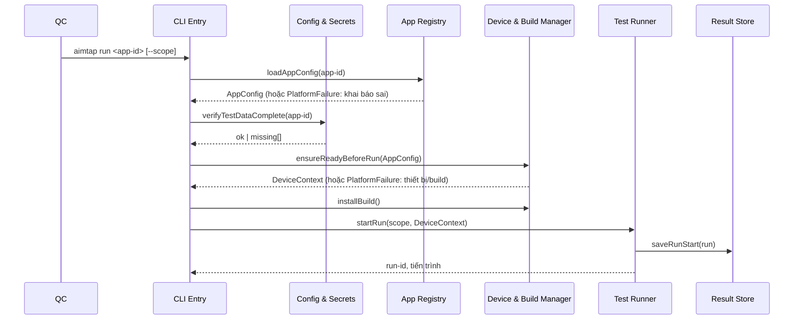
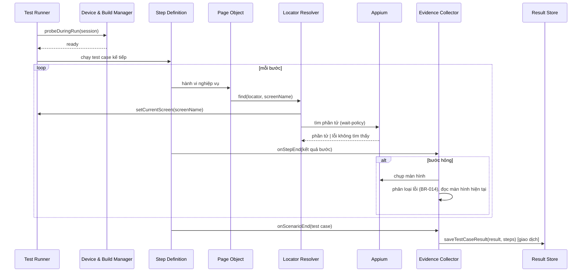
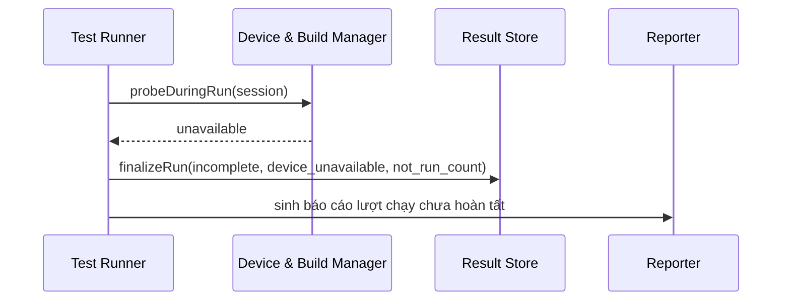
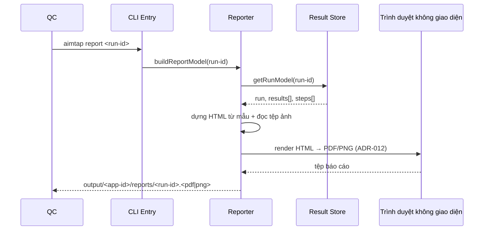

# Sequence Diagrams — Phase 1

Sơ đồ tương tác cho các luồng chính của Phase 1. Điểm có thể thất bại và cách xử lý ghi dưới mỗi sơ đồ.

---

## 1. Khởi chạy lượt chạy và kiểm tra tiền điều kiện (UC-06)

Điểm thất bại: bất kỳ kiểm tra tiền điều kiện nào không thỏa (khai báo, dữ liệu kiểm thử thiếu, bản build, thiết bị) làm lượt chạy **không mở**, không sinh bản ghi, không sinh báo cáo; lý do nêu theo từng mục (BR-015, FR-APP-04, UC-06 E1). Tập chạy rỗng cũng không mở lượt chạy (UC-06 E2).

---

## 2. Thực thi một test case và thu thập bằng chứng (UC-07)

Điểm thất bại: bước hỏng ⇒ test case `failed`, không chạy các bước còn lại, nhưng lượt chạy tiếp tục (BR-002). Lỗi khi chụp ảnh/ghi nhật ký được bắt trong Evidence Collector, đánh dấu `evidence_missing`, không đổi trạng thái test case (BR-004). Mất phiên giữa test case ⇒ `failed` loại `step_not_executed`; việc dừng lượt chạy do probe ở lần kiểm tra kế tiếp quyết định (UC-07 E2, BR-018).

---

## 3. Dừng lượt chạy khi thiết bị không còn sẵn sàng (UC-06 E4, BR-018)

Điểm thất bại: các test case chưa chạy **không** sinh bản ghi; số lượng ghi ở cấp lượt chạy (BR-012). Dữ liệu của các test case đã hoàn tất giữ nguyên vì mỗi test case đã ghi theo giao dịch ngay khi kết thúc (ADR-003). Lượt chạy chưa hoàn tất **vẫn** sinh báo cáo (FR-REP-01). Hủy bởi QC đi cùng luồng này với `stop_reason = cancelled_by_qc` (UC-06 E3).

---

## 4. Sinh báo cáo một lượt chạy (UC-08, FR-REP)

Điểm thất bại: báo cáo sinh lại được bất kỳ lúc nào từ dữ liệu đã lưu, không cần chạy lại test case (ADR-003, ADR-006) — cùng luồng chạy tự động ở cuối lượt chạy và khi QC gọi `aimtap report`. Phần bằng chứng có `evidence_missing` được thể hiện là thiếu, không bỏ trống (BR-004, UC-08 E2). Báo cáo nhóm bảng tóm tắt theo test feature; mỗi test case hỏng kèm ảnh bước hỏng, nhật ký, tên màn hình, loại lỗi, thông báo lỗi gốc (FR-REP-02).
