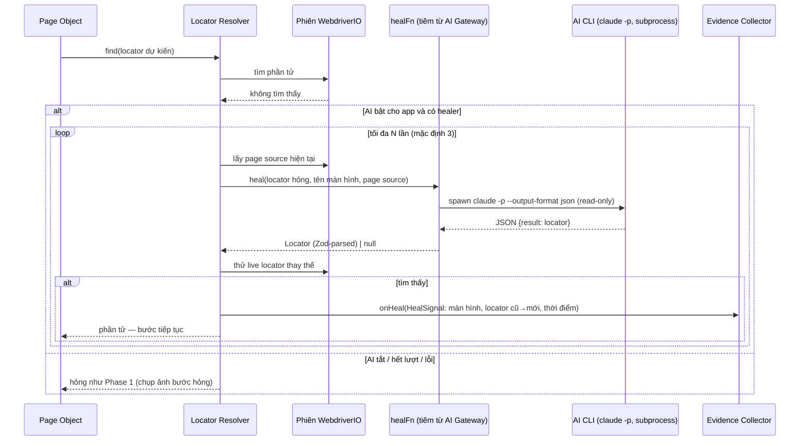
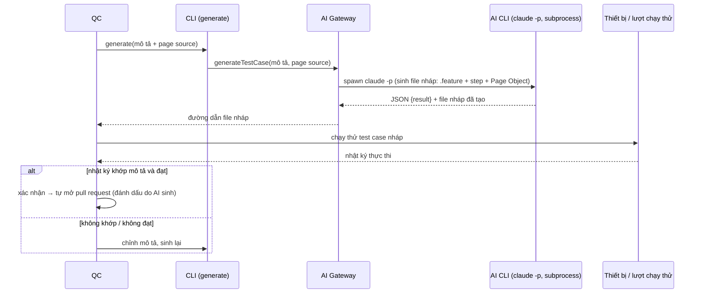
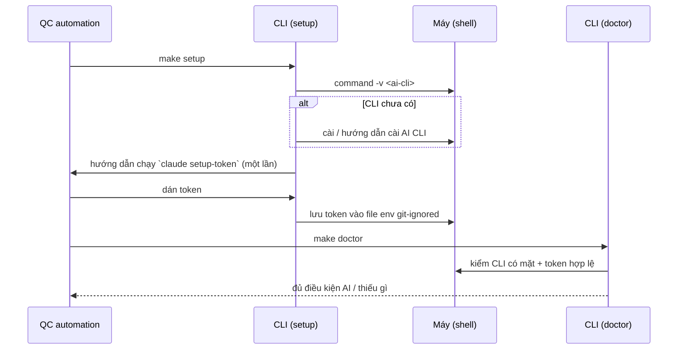

# Sequence Diagrams — Phase 2

## 1. Tự phục hồi một locator hỏng lúc chạy (UC-201)

**Điểm thất bại & xử lý:**
- CLI vắng/token hỏng/timeout/JSON sai định dạng → `healFn` trả `null` → coi như không suy được; hết lượt thì bước hỏng như Phase 1 (BR-208). Lỗi gọi AI KHÔNG dừng lượt chạy, KHÔNG tự đổi kết quả test case (NFR-204).
- Locator thay thế định vị **nhầm** phần tử → test có thể đạt giả; chặn bằng ghi `heal_event` + ảnh vào báo cáo để người rà soát (BR-206). Locator chỉ vào nhánh chính khi **con người** tự áp và mở PR sau review (BR-203; nền tảng không tạo PR).
- Locator đã phục hồi trong lượt chạy được dùng lại cho chính locator đó, không gọi lại AI (BR-202).
- Resolver đẩy `HealSignal` (tập con: màn hình, locator cũ→mới, thời điểm) — `find` giữ chữ ký ổn định (ADR-004) nên Resolver không biết số bước. Evidence enrich thành `heal_event`: `stepOrder` gán tại `onStepEnd`, `testCaseResultId` và `screenshotPath` điền tại `onScenarioEnd`.

## 2. Sinh test case với hỗ trợ AI (UC-203)

**Điểm thất bại & xử lý:**
- AI tắt cho app → không sinh qua AI; QC soạn tay như Phase 1 (BR-218).
- CLI lỗi/không phản hồi → không sinh lần này; QC thử lại hoặc soạn tay.
- Test case nháp có thể sai/thừa (BR-213) → bắt buộc QC chạy thử + xác nhận qua mô tả hành vi (BR-214) và chạy xanh trước khi mở PR (BR-215). Mở PR + git do **con người** làm sau review.

## 3. Cài đặt và kiểm tra môi trường AI (UC-205)

**Điểm thất bại & xử lý:**
- Thiếu CLI hoặc token → `doctor` báo rõ; tính năng AI không chạy, phần chạy test không dùng AI vẫn hoạt động (BR-221).
- Token là bí mật trong env git-ignored, che ở tầng log (ADR-026); không lên Git, không vào log/kết quả/báo cáo.
