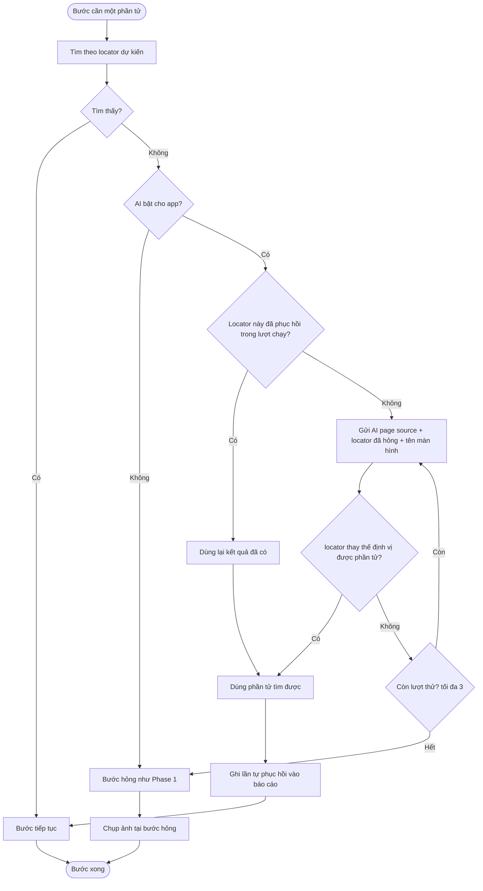
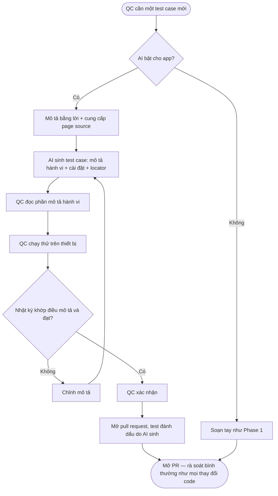
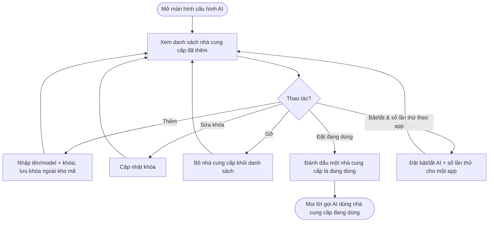
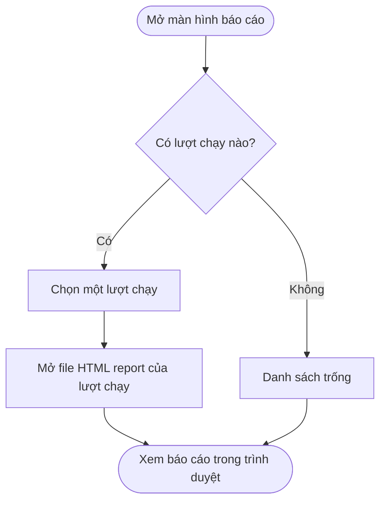

# Use Cases — Phase 2

Ba phần: tự phục hồi locator (UC-201), sinh test case (UC-203), và đa nhà cung cấp AI + giao diện (UC-205, UC-206).

Rà soát pull request là quy trình bình thường ngoài nền tảng (BC-08), không phải use case của nền tảng. Việc nền tảng làm được đặc tả bằng yêu cầu và quy tắc, không phải use case: đánh dấu test do AI sinh (FR-GEN-05, BR-216); và với tự phục hồi, tự tạo pull request sửa locator kèm ảnh (FR-HEAL-07, BR-210). Duyệt các pull request đó là rà soát bình thường bên ngoài.

Từ vựng trung tâm định nghĩa ở `brd.md` §1.1. Quy tắc nghiệp vụ ở `business-rules.md` Phase 2.

---

## UC-201: Tự phục hồi một locator hỏng lúc chạy

**Actor:** QC (người khởi chạy lượt chạy); nền tảng thực hiện tự phục hồi trong lúc chạy.

**Điều kiện tiên quyết:**
- Một lượt chạy đang thực thi một test case.
- Một bước cần thao tác với một phần tử theo locator dự kiến.

(Luồng chính là trường hợp AI đang bật cho app; AI tắt là luồng ngoại lệ E1.)

**Luồng chính:**
1. Nền tảng tìm phần tử theo locator dự kiến.
2. Không tìm thấy phần tử.
3. Nền tảng gửi AI page source hiện tại, locator đã hỏng và tên màn hình để AI suy ra phần tử cần tìm (BR-201).
4. AI trả về một locator thay thế định vị.
5. Nền tảng tìm được phần tử theo locator thay thế đó.
6. Bước tiếp tục với phần tử tìm được.
7. Nền tảng ghi một lần tự phục hồi vào báo cáo (locator dự kiến, locator thay thế đã dùng, màn hình, bước, thời điểm) (BR-205, BR-206).
8. Test case chạy tới hết; trạng thái do các phép kiểm quyết định. Test case đạt có lần tự phục hồi mang trạng thái "đạt kèm tự phục hồi" (BR-204).

**Luồng thay thế:**
- 2a. Cùng locator này đã được phục hồi trước đó trong lượt chạy: nền tảng dùng lại kết quả đã có, không gọi AI lần nữa (BR-202).
- 4a. Locator thay thế AI trả về không tìm thấy phần tử: nền tảng gọi lại AI, thử tối đa số lần cấu hình được (mặc định 3) (BR-202).
- 8a. Test case cuối cùng hỏng dù đã có tự phục hồi: các lần tự phục hồi vẫn được ghi vào báo cáo (BR-205); trạng thái test case là hỏng.

**Luồng ngoại lệ:**
- E1. AI tắt cho app: không gọi AI; bước hỏng như Phase 1 (BR-208).
- E2. AI không phản hồi hoặc lỗi: không có tự phục hồi; bước hỏng như Phase 1; lỗi gọi AI không làm dừng lượt chạy (BR-208).
- E3. Sau khi hết số lần thử, AI vẫn không đưa được locator thay thế định vị được phần tử: không có tự phục hồi; bước hỏng như Phase 1 (BR-202, BR-208).

**Flowchart:**

---

## UC-203: Soạn một test case mới với hỗ trợ AI

**Actor:** QC.

**Điều kiện tiên quyết:**
- AI đang bật cho app (BR-209).
- QC có page source của màn hình đích (lấy qua Appium Inspector hoặc nền tảng).

**Luồng chính:**
1. QC mô tả trường hợp cần kiểm thử bằng lời và cung cấp page source của màn hình đích (BR-211).
2. Nền tảng gọi AI sinh test case: phần mô tả hành vi + phần cài đặt, locator vào Page Object, ưu tiên tái dùng câu và phần cài đặt đã có (BR-212).
3. QC đọc phần mô tả hành vi của test case (BR-214).
4. QC chạy thử test case trên thiết bị.
5. QC đối chiếu nhật ký thực thi với điều mình đã mô tả.
6. Nhật ký khớp và test case đạt: QC xác nhận (BR-213).
7. QC mở pull request; test case được đánh dấu là do AI sinh (BR-215, BR-216).
8. Pull request đi qua rà soát và phê duyệt bình thường như mọi thay đổi code (BC-08).

**Luồng thay thế:**
- 5a. Nhật ký không khớp điều đã mô tả, hoặc test case không đạt: QC chỉnh mô tả và yêu cầu sinh lại (quay lại bước 2) (BR-213).

**Luồng ngoại lệ:**
- E1. AI tắt cho app: không sinh được test case qua AI; QC soạn tay như Phase 1 (BR-218).
- E2. AI không phản hồi hoặc lỗi: không sinh được lần này; QC thử lại hoặc soạn tay.

**Flowchart:**

---

## UC-205: Cấu hình AI qua giao diện

**Actor:** QC / QC Lead.

**Điều kiện tiên quyết:**
- Giao diện cấu hình chạy cục bộ đang mở.

**Luồng chính:**
1. Người dùng mở màn hình cấu hình AI: thấy danh sách nhà cung cấp đã thêm, mỗi dòng gồm tên nhà cung cấp, model, trạng thái khóa (đã nhập hay chưa), và dấu "đang dùng".
2. Thêm một nhà cung cấp: nhập tên/model và khóa; nền tảng lưu khóa ngoài kho mã (BR-220).
3. Đặt một nhà cung cấp làm "đang dùng" (BR-219).
4. Từ đó mọi lời gọi AI — tự phục hồi và sinh test case — dùng nhà cung cấp đang dùng (BR-219, FR-PROV-03).
5. Với từng app, bật hoặc tắt AI và đặt số lần thử tự phục hồi qua giao diện (BR-202, BR-209).

**Luồng thay thế:**
- 2a. Sửa khóa của một nhà cung cấp đã có.
- 2b. Gỡ một nhà cung cấp khỏi danh sách.
- 3a. Đổi nhà cung cấp đang dùng sang cái khác: cái cũ trở về "chưa dùng", vẫn đúng một cái đang dùng.

**Luồng ngoại lệ:**
- E1. Chưa chọn nhà cung cấp đang dùng nào: tính năng AI không chạy (như khi AI tắt) cho tới khi chọn (BR-219).

**Flowchart:**

---

## UC-206: Mở báo cáo lượt chạy qua giao diện

**Actor:** QC.

**Điều kiện tiên quyết:**
- Có ít nhất một lượt chạy đã sinh file HTML report.

**Luồng chính:**
1. Người dùng mở màn hình báo cáo: thấy danh sách các lượt chạy đã có.
2. Chọn một lượt chạy.
3. Nền tảng mở file HTML report của lượt chạy đó (BR-223).

**Luồng thay thế:**
- (không có)

**Luồng ngoại lệ:**
- E1. Chưa có lượt chạy nào: danh sách trống, không có gì để mở.

**Flowchart:**

