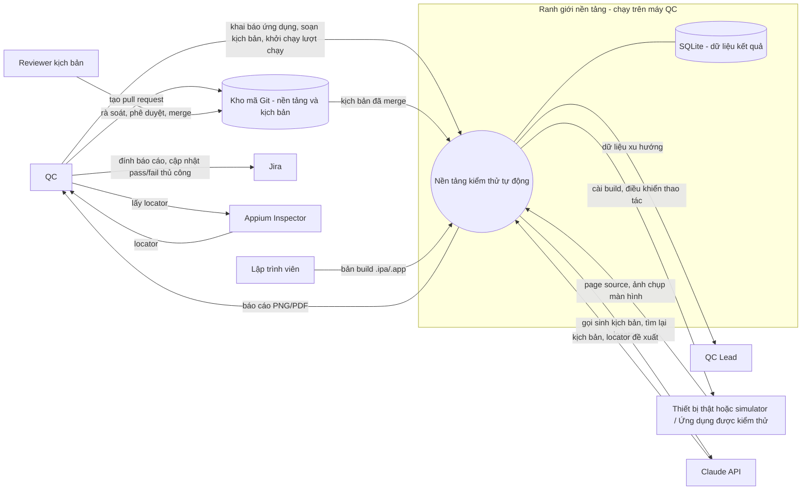

# Business Requirements Document

Tài liệu này mô tả yêu cầu nghiệp vụ của toàn dự án, bao trùm cả ba phase. Nội dung riêng của từng phase nằm ở `docs/business/phase-{N}/`.

---

## 1. Tóm tắt dự án

Nền tảng tự động hóa kiểm thử ứng dụng di động, chạy nội bộ trên máy của QC, thay thế phần kiểm thử hồi quy đang thực hiện thủ công. Người dùng là đội QC nội bộ.

Nền tảng là công cụ dùng chung, không gắn với một ứng dụng cụ thể: mọi thứ phụ thuộc vào ứng dụng được kiểm thử (bản build, locator, Page Object, kịch bản, cấu hình thiết bị) đều được khai báo từ bên ngoài, để cùng một nền tảng áp dụng được cho ứng dụng di động bất kỳ. Nền tảng iOS được hỗ trợ trước, Android chưa nằm trong phạm vi.

Dự án triển khai theo ba giai đoạn: nền tảng thực thi cơ bản không có AI, sau đó bổ sung AI hỗ trợ soạn kịch bản và tự phục hồi locator, cuối cùng là lớp phân tích xu hướng chất lượng. Mỗi giai đoạn được đưa vào sử dụng và chứng minh giá trị trước khi mở rộng sang giai đoạn kế tiếp.

**Kịch bản** trong tài liệu này gồm hai phần: phần mô tả hành vi bằng ngôn ngữ tự nhiên theo góc nhìn người dùng, và phần cài đặt thực thi từng câu mô tả. Phần mô tả hành vi là thứ được thực thi, không phải tài liệu đi kèm.

**Bằng chứng thực thi** của một kịch bản gồm ba thứ: trạng thái kết quả, nhật ký các bước đã chạy kèm kết quả từng bước, và ảnh chụp màn hình tại bước hỏng.

---

## 2. Business Objectives

| Mã | Mục tiêu |
|---|---|
| BO-01 | Chuyển phần kiểm thử hồi quy các luồng chính từ thủ công sang tự động. |
| BO-02 | Giảm chi phí bảo trì kịch bản khi giao diện ứng dụng thay đổi. |
| BO-03 | Rút ngắn thời gian soạn một kịch bản kiểm thử mới. |
| BO-04 | Tích lũy dữ liệu kết quả kiểm thử có cấu trúc để trả lời được các câu hỏi về xu hướng chất lượng. |
| BO-05 | Giữ quyền kết luận chất lượng thuộc về con người khi đưa AI vào quy trình. |
| BO-06 | Áp dụng được cho ứng dụng di động bất kỳ, không phụ thuộc vào nghiệp vụ của một ứng dụng cụ thể. |
| BO-07 | Hạ ngưỡng kỹ năng để soạn một kịch bản kiểm thử: từ Phase 2, người soạn kịch bản không cần viết hay đọc phần cài đặt. |

---

## 3. Stakeholders

| Stakeholder | Vai trò | Kỳ vọng |
|---|---|---|
| QC | Người dùng chính. Soạn kịch bản, chuẩn bị thiết bị, chạy bộ kịch bản, đọc báo cáo, cập nhật kết quả lên Jira. | Chạy được hồi quy mà không thao tác tay từng bước; khi kịch bản hỏng thì biết hỏng ở màn hình nào, bước nào. |
| Reviewer kịch bản | Dev hoặc QC Lead. Rà soát kịch bản trong pull request và phê duyệt trước khi merge vào nhánh chính. | Đọc được thay đổi của một pull request và hiểu kịch bản kiểm tra điều gì. |
| QC Lead | Người chịu trách nhiệm chất lượng đầu ra kiểm thử. Quyết định phạm vi kịch bản, tiêu thụ lớp phân tích. Có thể đồng thời là reviewer. | Nắm được độ phủ hồi quy, tỷ lệ vượt qua theo thời gian, kịch bản nào thiếu ổn định. |
| Lập trình viên | Cung cấp bản build đã ký; tiếp nhận lỗi do kiểm thử phát hiện. | Nhận được thông tin lỗi đủ để tái hiện: bước hỏng, các bước đã chạy trước đó, ảnh chụp lúc hỏng, tên màn hình, loại lỗi. |
| Product Owner | Phê duyệt phạm vi và trình tự giai đoạn; cấp nguồn lực; kiểm soát quy trình rà soát pull request. | Mỗi giai đoạn có kết quả dùng được, không phải chờ hệ thống hoàn chỉnh. |

### 3.1. Năng lực yêu cầu ở vai trò QC theo từng phase

| Phase | Viết phần cài đặt của kịch bản | Đọc phần cài đặt của kịch bản | Đọc và viết mô tả hành vi bằng tiếng Anh |
|---|---|---|---|
| 1 | Bắt buộc | Bắt buộc | Bắt buộc |
| 2 | Không | Không | Bắt buộc |
| 3 | Không | Không | Bắt buộc |

Tiếng Anh là ngôn ngữ chính của đội. Toàn bộ nội dung trong kho mã, gồm cả phần mô tả hành vi của kịch bản, viết bằng tiếng Anh.

Từ Phase 2, QC xác nhận kịch bản qua phần mô tả hành vi. Việc rà soát phần cài đặt thuộc về vai trò Reviewer kịch bản, thực hiện trong pull request.

---

## 4. Context Diagram

---

## 5. Dòng giá trị

| Giá trị | Người nhận | Xuất hiện từ |
|---|---|---|
| Thời gian thực hiện một vòng hồi quy các luồng chính giảm, do máy thực hiện thay vì thao tác tay từng bước. | QC | Phase 1 |
| Bằng chứng thực thi có cấu trúc cho mỗi kịch bản: trạng thái, nhật ký các bước đã chạy, và ảnh chụp tại bước hỏng — gắn vào task Jira, thay cho ảnh chụp rời rạc do QC tự lưu. | QC, Lập trình viên | Phase 1 |
| Dữ liệu kết quả tích lũy theo từng lượt chạy, làm nền cho phân tích về sau. | QC Lead | Phase 1 |
| Một nền tảng dùng lại được cho ứng dụng tiếp theo mà không phải dựng lại từ đầu. | QC Lead, Product Owner | Phase 1 |
| Thời gian soạn một kịch bản mới giảm, do AI sinh kịch bản từ mô tả và page source. | QC | Phase 2 |
| Người soạn kịch bản không cần biết lập trình, nên số người soạn được kịch bản không còn giới hạn ở người biết code. | QC Lead, Product Owner | Phase 2 |
| Chi phí bảo trì kịch bản giảm khi giao diện thay đổi, do locator hỏng được tìm lại lúc chạy thay vì làm dừng cả lượt chạy. | QC | Phase 2 |
| Trả lời được câu hỏi về xu hướng chất lượng: tỷ lệ vượt qua theo thời gian, màn hình hay hỏng, kịch bản thiếu ổn định. | QC Lead, Product Owner | Phase 3 |

---

## 6. Happy path

### QC — đưa một ứng dụng mới vào nền tảng (Phase 1)
1. Khai báo ứng dụng cần kiểm thử: định danh ứng dụng, bản build, thiết bị và phiên bản hệ điều hành đích.
2. Tạo Page Object cho các màn hình của ứng dụng.
3. Soạn bộ kịch bản cho các luồng chính của ứng dụng.

### QC — chạy một vòng hồi quy (Phase 1)
1. Nhận bản build đã ký từ lập trình viên.
2. Chuẩn bị thiết bị thật hoặc simulator và cài bản build lên thiết bị.
3. Chọn bộ kịch bản cần chạy và khởi chạy lượt chạy.
4. Nền tảng thực thi từng kịch bản, ghi nhật ký các bước đã chạy, ghi trạng thái kết quả, và chụp ảnh màn hình tại bước hỏng của các kịch bản hỏng.
5. Nền tảng xuất báo cáo PNG/PDF của lượt chạy và ghi bản ghi kết quả vào SQLite.
6. QC đọc báo cáo, đính vào task Jira, cập nhật trạng thái pass/fail.

### QC — soạn một kịch bản mới (Phase 1)
1. Mở màn hình đích trên thiết bị, lấy locator qua Appium Inspector.
2. Khai báo locator của màn hình vào Page Object tương ứng.
3. Viết phần mô tả hành vi của kịch bản bằng ngôn ngữ tự nhiên.
4. Cài đặt phần thực thi cho những câu mô tả chưa có sẵn.
5. Chạy thử kịch bản trên thiết bị và điều chỉnh cho tới khi kết quả ổn định.
6. Tạo pull request.

### QC — soạn một kịch bản mới với hỗ trợ AI (Phase 2)
1. Mô tả kịch bản kiểm thử bằng lời và cung cấp page source của màn hình đích.
2. Nền tảng gọi Claude sinh kịch bản.
3. QC đọc phần mô tả hành vi của kịch bản, chạy thử, đối chiếu nhật ký thực thi với điều mình mô tả, điều chỉnh và sinh lại nếu chưa đúng.
4. QC tạo pull request.

### Reviewer kịch bản — phê duyệt một kịch bản (Phase 1 trở đi)
1. Nhận pull request chứa kịch bản mới hoặc kịch bản đã sửa.
2. Rà soát phần mô tả hành vi, phần cài đặt và Page Object.
3. Phê duyệt và merge vào nhánh chính, hoặc trả lại kèm yêu cầu chỉnh sửa.

### Lập trình viên — tiếp nhận một lỗi (Phase 1)
1. Nhận task Jira kèm báo cáo lượt chạy.
2. Đọc nhật ký thực thi để biết kịch bản đã đi qua những bước nào và hỏng ở bước nào.
3. Xem ảnh chụp màn hình tại bước hỏng để biết ứng dụng đang ở trạng thái nào lúc đó.
4. Tái hiện lỗi và xử lý.

### QC — xử lý một lần tự phục hồi (Phase 2)
1. Trong lúc chạy, một locator không tìm thấy.
2. Nền tảng gọi Claude tìm lại thành phần tương ứng và tiếp tục kịch bản.
3. Nền tảng ghi lại lần tự phục hồi, đặt trạng thái kịch bản là "đạt kèm tự phục hồi", và phát cảnh báo trong báo cáo.
4. QC xác nhận locator được đề xuất; thay đổi Page Object tương ứng đi qua pull request như mọi thay đổi khác.

### QC Lead — xem xu hướng chất lượng (Phase 3)
1. Truy vấn dữ liệu kết quả đã tích lũy.
2. Xem tỷ lệ vượt qua theo thời gian, danh sách màn hình hay hỏng, danh sách kịch bản thiếu ổn định.
3. Quyết định điều chỉnh phạm vi kịch bản hoặc ưu tiên sửa lỗi.

---

## 7. Phạm vi MVP

### Trong phạm vi
- Khai báo một ứng dụng di động bất kỳ vào nền tảng: định danh ứng dụng, bản build, thiết bị và phiên bản hệ điều hành đích.
- Soạn kịch bản kiểm thử thủ công: mô tả hành vi bằng ngôn ngữ tự nhiên và phần cài đặt bằng WebdriverIO chạy trên Appium, locator tổ chức theo Page Object.
- Lấy locator của màn hình qua Appium Inspector.
- Cài bản build ứng dụng iOS lên thiết bị thật hoặc simulator trước khi chạy.
- Thực thi bộ kịch bản trên thiết bị thật và trên simulator.
- Thu thập bằng chứng thực thi cho mỗi kịch bản: trạng thái kết quả, nhật ký các bước đã chạy kèm kết quả từng bước, và ảnh chụp màn hình tại bước hỏng.
- Xuất báo cáo PNG/PDF cho mỗi lượt chạy, ở định dạng đính được vào Jira.
- Ghi bản ghi kết quả dạng JSON cho mỗi kịch bản trong mỗi lượt chạy, lưu vào SQLite trên máy QC.
- Sinh kịch bản qua Claude từ mô tả bằng lời và page source.
- Đưa phần mô tả hành vi của kịch bản tới QC để xác nhận mà không cần đọc phần cài đặt.
- Tự phục hồi locator lúc chạy qua Claude, kèm ghi nhận và phát cảnh báo cho mỗi lần tự phục hồi.
- Bật hoặc tắt việc gọi Claude bằng cấu hình.
- Truy vấn dữ liệu đã tích lũy để trả lời câu hỏi xu hướng.

### Ngoài phạm vi
- Kiểm thử ứng dụng Android. Toàn bộ nguồn lực tập trung cho iOS.
- Kịch bản, Page Object và tri thức nghiệp vụ của một ứng dụng cụ thể. Nền tảng cung cấp cơ chế; nội dung kịch bản do QC của từng ứng dụng soạn.
- Chụp màn hình ở mọi bước của kịch bản. Ảnh chỉ được chụp tại bước hỏng và tại các bước được đánh dấu tường minh.
- Cơ chế đặt lại ứng dụng giữa các lượt chạy. Mỗi kịch bản tự đưa ứng dụng về trạng thái nó cần.
- Đưa kịch bản vào nhánh chính mà không qua pull request được phê duyệt, kể cả kịch bản do AI sinh.
- Máy chủ kết quả tập trung và tổng hợp dữ liệu xuyên nhiều máy QC.
- Tích hợp vào quy trình CI/CD.
- Dịch vụ thiết bị trên cloud.
- AI tự phê duyệt kịch bản hoặc tự kết luận chất lượng.
- Tích hợp tự động với Jira. QC đính báo cáo và cập nhật trạng thái thủ công.
- Kiểm thử hiệu năng, bảo mật, khả năng truy cập của ứng dụng.
- Kiểm thử giao diện dựa trên so sánh ảnh (visual regression).
- Quản lý ca kiểm thử (test case management) thay thế công cụ hiện có.
- Chi tiết kiến trúc, cấu hình và quy ước viết mã.

---

## 8. Business Constraints

| Mã | Ràng buộc |
|---|---|
| BC-01 | Kiểm thử iOS yêu cầu máy macOS. Giai đoạn đầu cần tối thiểu một máy Mac. |
| BC-02 | Nền tảng chạy nội bộ trên máy QC, không có máy chủ, không triển khai online. |
| BC-03 | Bản build do lập trình viên cung cấp, đã ký đúng và sẵn sàng cài lên thiết bị. |
| BC-04 | Việc gọi Claude yêu cầu kết nối mạng và một khóa API hợp lệ; phát sinh chi phí theo lượt gọi. |
| BC-05 | Jira là điểm tổng hợp kết quả. Thao tác đính báo cáo do QC thực hiện thủ công. |
| BC-06 | Kết quả kiểm thử chỉ có giá trị lặp lại khi chạy trên bản build chính thức và mỗi kịch bản tự đảm bảo điều kiện tiên quyết của nó. |
| BC-07 | Kịch bản và Page Object được quản lý bằng Git, nằm chung kho mã với nền tảng. |
| BC-08 | Mọi thay đổi kịch bản và Page Object vào nhánh chính đi qua pull request được rà soát và phê duyệt, không phân biệt do người hay AI tạo ra. Quy trình rà soát do product owner kiểm soát, nằm ngoài phạm vi nền tảng. |
| BC-09 | Nền tảng hỗ trợ thực thi trên cả thiết bị thật và simulator. |
| BC-10 | Tiếng Anh là ngôn ngữ chính của đội. Toàn bộ nội dung trong kho mã viết bằng tiếng Anh. |
| BC-11 | Mỗi lần chụp màn hình tốn từ vài trăm mili giây tới vài giây tùy thiết bị, nên số lần chụp trong một lượt chạy được giữ ở mức tối thiểu. |

---

## 9. Non-functional Requirements (mức cao)

| Mã | Yêu cầu | Giai đoạn |
|---|---|---|
| NFR-01 | Nền tảng chạy nội bộ trên máy QC, không yêu cầu máy chủ hay triển khai online. | 1 |
| NFR-02 | Kiểm thử iOS chạy trên macOS. | 1 |
| NFR-03 | Kịch bản chạy trên bản build chính thức và cho kết quả lặp lại, không phụ thuộc thứ tự chạy hay trạng thái còn lại từ lượt chạy trước. | 1 |
| NFR-04 | Khóa API của Claude được lưu an toàn và không nằm trong kho mã. | 2 |
| NFR-05 | Việc gọi Claude lúc chạy kiểm soát được về độ trễ và chi phí, bật hoặc tắt được bằng cấu hình. | 2 |
| NFR-06 | Quyền kết luận đạt hay hỏng và quyền chấp nhận kịch bản thuộc về con người. AI chỉ hỗ trợ. Việc chấp nhận kịch bản thực hiện qua phê duyệt pull request. | 2 |
| NFR-07 | Nền tảng không chứa tri thức riêng của bất kỳ ứng dụng nào. Mọi thông tin phụ thuộc ứng dụng được khai báo từ bên ngoài, để đưa một ứng dụng mới vào kiểm thử không cần sửa nền tảng. | 1 |
| NFR-08 | Từ Phase 2, mọi thao tác của QC trên nền tảng thực hiện được mà không cần đọc hay viết phần cài đặt của kịch bản. | 2 |
| NFR-09 | Phần mô tả hành vi của kịch bản luôn khớp với hành vi được thực thi. | 1 |

Yêu cầu phi chức năng ở mức chi tiết hơn, gồm hiệu năng thu thập bằng chứng và ngôn ngữ trong kho mã, nằm ở `docs/requirement.md` §5 với mã từ NFR-10 trở đi.

---

## 10. Success Metrics

Chỉ tiêu định lượng không được đặt trước khi triển khai. Sau khi Phase 1 vận hành thật, các chỉ số sau được đo và dùng làm cơ sở quyết định có mở rộng sang Phase 2 hay không:

| Mã | Chỉ số | Đo từ |
|---|---|---|
| SM-01 | Số luồng nghiệp vụ được phủ bởi kịch bản tự động. | Phase 1 |
| SM-02 | Thời gian thực hiện một vòng hồi quy tự động. | Phase 1 |
| SM-03 | Tỷ lệ lượt chạy cho kết quả lặp lại (không dao động do nguyên nhân ngoài lỗi ứng dụng). | Phase 1 |
| SM-04 | Thời gian soạn một kịch bản mới, so sánh trước và sau khi có hỗ trợ AI. | Phase 2 |
| SM-05 | Số lần tự phục hồi thành công so với số lần locator hỏng. | Phase 2 |
| SM-06 | Tỷ lệ pull request chứa kịch bản do AI sinh được phê duyệt mà không phải sửa phần cài đặt. | Phase 2 |

---

## 11. Giả định

| Mã | Nội dung | Ảnh hưởng nếu sai |
|---|---|---|
| AS-01 | Vai trò QC Lead tồn tại tách biệt với QC. | Chỉ gộp actor, không đổi nội dung epic. |
| AS-02 | Nội dung màn hình của các ứng dụng được kiểm thử không chứa dữ liệu nhạy cảm, nên page source và ảnh chụp gửi tới Claude không bị giới hạn. | Phase 2 phải bổ sung quy tắc lọc dữ liệu trước khi gửi ra ngoài. Rủi ro này tăng khi nền tảng được dùng cho ứng dụng khác về sau. |
| AS-03 | Kịch bản được chạy theo yêu cầu do QC khởi động thủ công, không có lịch chạy tự động. | Bổ sung cơ chế lập lịch vào phạm vi. |
| AS-04 | Mỗi QC làm việc trên một máy riêng, dữ liệu kết quả nằm cục bộ trên máy đó. Kịch bản dùng chung qua Git, dữ liệu kết quả không dùng chung. | Ảnh hưởng cách tổng hợp dữ liệu cho lớp phân tích ở Phase 3. |
| AS-05 | Nhật ký thực thi cung cấp đủ thông tin để điều tra một kịch bản hỏng mà không cần ảnh chụp của các bước trước bước hỏng. | Phải chụp màn hình ở mọi bước, làm tăng thời lượng lượt chạy và ảnh hưởng SM-02. |

Các mục cần làm rõ khi mở đặc tả từng phase nằm ở `docs/handoff/open-items.md`.

---

## Nguồn tham chiếu

| Nội dung lấy từ research | Nguồn |
|---|---|
| WebdriverIO là framework tự động hóa cho ứng dụng web và di động; Appium là framework mã nguồn mở cho ứng dụng di động qua giao thức WebDriver. Page Object Model áp dụng cho di động dưới dạng screen object, tách kịch bản khỏi locator. | [WebdriverIO Appium Tutorial](https://www.testmuai.com/learning-hub/webdriverio-appium/), [Mobile Test Automation using WebDriver.io and Appium](https://spurqlabs.com/mobile-test-automation-using-webdriver-io-and-appium/) |
| Cơ chế self-healing: chặn lỗi không tìm thấy phần tử, so sánh trạng thái giao diện hiện tại với dữ liệu locator lịch sử, đề xuất locator thay thế lúc chạy. Rủi ro đi kèm là bám nhầm phần tử tương đương làm kịch bản báo đạt trong khi ứng dụng đã hỏng. | [Healenium – Self-healing locator tool](https://blog.nashtechglobal.com/healenium-self-healing-locator-tool-for-automation-test/), [The 6 Types of AI Self-Healing in Test Automation](https://www.qawolf.com/blog/self-healing-test-automation-types), [Self-Healing Test Automation 2026 Guide](https://qaskills.sh/blog/self-healing-test-automation-2026-guide) |
| Báo cáo kiểm thử tiêu chuẩn gồm: ảnh chụp màn hình đính kèm, các bước thực hiện, dòng thời gian chạy, phân loại lỗi, và dữ liệu lịch sử để theo dõi xu hướng. | [Allure Report](https://allurereport.org/), [Generating Advanced Test Reports with Allure](https://www.browserstack.com/guide/generate-allure-test-report) |
| Chi phí thời gian của việc chụp màn hình trong lúc chạy Appium, và khuyến nghị chụp có chọn lọc thay vì chụp mọi bước. | [Appium Discuss — screen capture time](https://discuss.appium.io/t/help-screen-capture-function-takes-5-seconds-for-1-image/23283), [Appium Running Slow? 7 Fixes](https://devicelab.dev/blog/appium-slow-7-fixes-that-work) |
| Chỉ số phân tích chất lượng phổ biến: tỷ lệ vượt qua theo lượt chạy, kịch bản thiếu ổn định (xác định qua việc trạng thái đổi qua lại giữa các lượt chạy), kịch bản hỏng nhiều nhất. | [Reporting and metrics in ReportPortal](https://reportportal.io/docs/dashboards-and-widgets/ReportingAndMetricsInReportPortal/), [Test Automation Analytics](https://testdino.com/blog/test-automation-analytics) |
| Sinh kịch bản bằng LLM từ mô tả bằng ngôn ngữ tự nhiên kèm page source hoặc ảnh chụp màn hình; kịch bản biểu diễn dưới dạng các bước bằng lời để người không lập trình đọc được. | [appium-llm-plugin](https://github.com/headspinio/appium-llm-plugin), [Automating Appium Script Generation Using AI Tools](https://kobiton.com/mobile-testing-guide/mobile-test-automation/automating-appium-script-generation-using-ai-tools/), [Alumnium](https://alumnium.ai/) |
