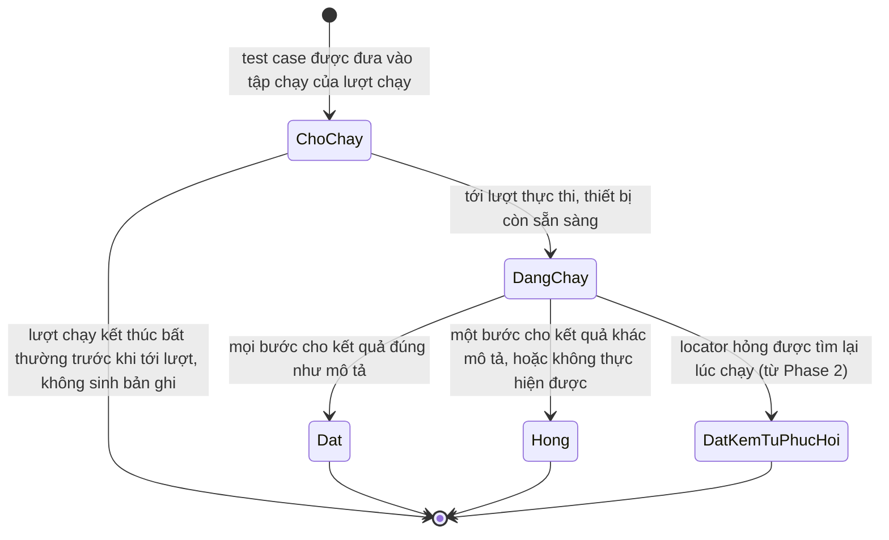
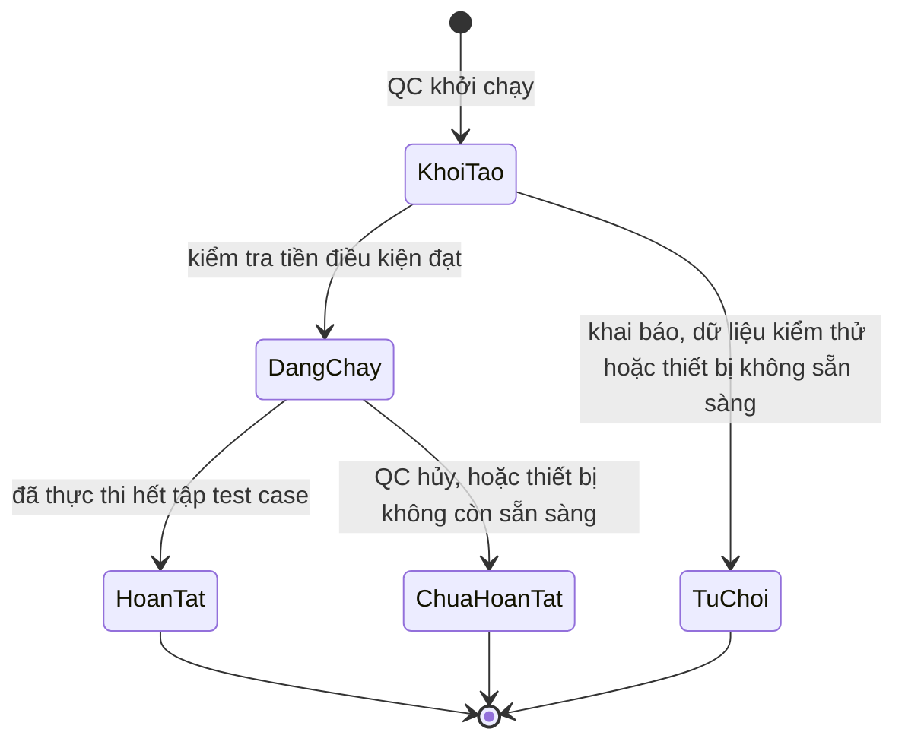

# Business Rules — Phase 1

Các quy tắc bắt buộc của nền tảng trong Phase 1. Mỗi quy tắc được tham chiếu chéo từ `srs.md`, `use-cases.md` và `user-stories.md`.

Từ vựng trung tâm (test suite, test feature, test case, bước) định nghĩa ở `brd.md` §1.1.

Thực thể trung tâm của Phase 1 là **một test case trong một lượt chạy**: một lần thực thi một test case, thuộc về đúng một lượt chạy, mang đúng một trạng thái kết quả và một bộ bằng chứng thực thi.

---

## State diagram — vòng đời một test case trong một lượt chạy

Trạng thái `DatKemTuPhucHoi` chỉ phát sinh từ Phase 2, nhưng nằm trong tập giá trị hợp lệ của dữ liệu kết quả từ Phase 1.

Test case nằm trong tập chạy nhưng không được thực thi không sinh bản ghi kết quả. Số lượng test case chưa chạy được ghi ở cấp lượt chạy (BR-012). Một bản ghi kết quả tồn tại đồng nghĩa với việc test case đó đã được thực thi.

---

## State diagram — vòng đời một lượt chạy

Lượt chạy ở trạng thái `TuChoi` không sinh bản ghi kết quả nào và không sinh báo cáo. Lượt chạy ở trạng thái `ChuaHoanTat` giữ nguyên dữ liệu của các test case đã hoàn tất và vẫn sinh báo cáo.

---

## BR-001: Trạng thái của một test case trong một lượt chạy

- Quy tắc: Mỗi test case đã được thực thi trong một lượt chạy mang đúng một trạng thái, thuộc tập: `đạt`, `hỏng`, `đạt kèm tự phục hồi`. Trạng thái `đạt` chỉ được gán khi mọi bước của test case cho kết quả đúng như phần mô tả hành vi.
- Nếu vi phạm: dữ liệu kết quả không phản ánh đúng chất lượng ứng dụng, và lớp phân tích ở Phase 3 tính sai tỷ lệ vượt qua.
- Áp dụng cho: UC-06, UC-07.

## BR-002: Một test case hỏng không dừng lượt chạy

- Quy tắc: Test case kết thúc ở trạng thái `hỏng` không làm dừng các test case còn lại của lượt chạy, không phụ thuộc loại lỗi.
- Nếu vi phạm: một lỗi ở test case đầu tiên che mất kết quả của toàn bộ phần còn lại, và QC phải chạy lại nhiều lần để có được bức tranh đầy đủ.
- Áp dụng cho: UC-06.
- Lý do: các test case độc lập với nhau về logic và dữ liệu (BR-005, BR-016), nên kết quả của test case này không nói gì về test case kế tiếp. Trường hợp duy nhất làm lượt chạy dừng là tài nguyên dùng chung không còn, và trường hợp đó do BR-018 điều chỉnh, không phải do trạng thái của một test case.

## BR-003: Chụp màn hình có chọn lọc

- Quy tắc: Hệ thống chụp một ảnh màn hình tại bước hỏng của một test case hỏng. Các bước khác không chụp, trừ những bước được đánh dấu tường minh là cần chụp. Test case đạt không có ảnh chụp.
- Nếu vi phạm: thời lượng lượt chạy tăng trên mọi test case, kể cả test case đạt, ảnh hưởng trực tiếp SM-02.
- Áp dụng cho: UC-07.
- Lý do: mỗi lần chụp tốn từ vài trăm mili giây tới vài giây tùy thiết bị (BC-11), và lúc chạy chưa biết bước nào sẽ hỏng nên muốn có ảnh của các bước trước thì buộc phải chụp mọi bước.

## BR-004: Bằng chứng thực thi là thứ phụ trợ

- Quy tắc: Lỗi phát sinh khi chụp màn hình hoặc ghi nhật ký không làm thay đổi trạng thái của test case. Phần bằng chứng thiếu được ghi nhận là thiếu.
- Nếu vi phạm: một test case đạt bị báo hỏng vì lý do không liên quan tới ứng dụng, làm mất giá trị của kết quả kiểm thử.
- Áp dụng cho: UC-07.

## BR-005: Test case tự đảm bảo điều kiện tiên quyết

- Quy tắc: Mỗi test case tự đưa ứng dụng về trạng thái nó cần ở bước mở đầu. Test case không giả định trạng thái do test case trước hay lượt chạy trước để lại. Nền tảng không đặt lại ứng dụng giữa các test case.
- Nếu vi phạm: kết quả phụ thuộc thứ tự chạy, vi phạm NFR-03.
- Áp dụng cho: UC-03, UC-06.

## BR-006: Mọi thay đổi test case đi qua pull request được phê duyệt

- Quy tắc: Test case và Page Object chỉ vào nhánh chính qua pull request đã được reviewer phê duyệt, không phân biệt do người hay AI tạo ra.
- Nếu vi phạm: test case sai đi vào bộ hồi quy chung và cho kết quả không đáng tin trên máy của mọi QC.
- Áp dụng cho: UC-04.

## BR-007: Locator chỉ nằm trong Page Object

- Quy tắc: Toàn bộ locator của một màn hình nằm trong Page Object của màn hình đó. Phần cài đặt của test case không chứa locator trực tiếp.
- Nếu vi phạm: một thay đổi giao diện đòi hỏi sửa nhiều chỗ rải rác, làm tăng chi phí bảo trì (BO-02), và Phase 2 không có một nơi xác định để đặt locator được tìm lại.
- Áp dụng cho: UC-02, UC-03.

## BR-008: Nền tảng không chứa tri thức của ứng dụng

- Quy tắc: Mọi thông tin phụ thuộc ứng dụng — định danh, bản build, thiết bị đích, Page Object, test case, dữ liệu kiểm thử — được khai báo từ bên ngoài phần dùng chung của nền tảng. Mỗi test case, Page Object và bản ghi kết quả thuộc về đúng một ứng dụng đã khai báo.
- Nếu vi phạm: đưa ứng dụng thứ hai vào kiểm thử đòi hỏi sửa nền tảng, vi phạm NFR-07 và BO-06.
- Áp dụng cho: UC-01.

## BR-009: Dữ liệu kết quả chỉ ghi thêm

- Quy tắc: Mỗi test case đã được thực thi trong một lượt chạy sinh đúng một bản ghi kết quả. Lượt chạy mới không ghi đè hay xóa dữ liệu của lượt chạy trước. Bản ghi mang đầy đủ bối cảnh của lượt chạy tại thời điểm chạy.
- Nếu vi phạm: dữ liệu lịch sử không đủ để phân tích xu hướng ở Phase 3, và dữ liệu đã mất không thu thập ngược lại được.
- Áp dụng cho: UC-07.

## BR-010: Mô tả hành vi khớp hành vi được thực thi

- Quy tắc: Phần mô tả hành vi bằng ngôn ngữ tự nhiên là thứ được thực thi. Các bước trong nhật ký thực thi mang đúng nội dung các câu mô tả hành vi của test case.
- Nếu vi phạm: QC xác nhận một test case dựa trên mô tả không đúng với hành vi thật, và từ Phase 2 thì QC không còn cách nào phát hiện sai lệch vì không đọc phần cài đặt.
- Áp dụng cho: UC-03, UC-07.

## BR-011: Trạng thái tổng hợp của lượt chạy

- Quy tắc: Lượt chạy được xem là đạt khi mọi test case trong tập chạy ở trạng thái `đạt` hoặc `đạt kèm tự phục hồi`. Chỉ một test case `hỏng` làm lượt chạy không đạt. Trạng thái tổng hợp tính trên tập test case đã chọn để chạy, không tính trên toàn bộ test suite của ứng dụng.
- Nếu vi phạm: một lượt chạy tập con bị hiểu nhầm là kết quả hồi quy đầy đủ.
- Áp dụng cho: UC-06, UC-08.

## BR-012: Lượt chạy kết thúc bất thường vẫn giữ kết quả phần đã chạy

- Quy tắc: Khi lượt chạy dừng giữa chừng, kết quả của các test case đã hoàn tất được giữ nguyên và vẫn sinh báo cáo. Lượt chạy được đánh dấu là chưa hoàn tất, ghi số test case chưa chạy và lý do dừng ở cấp lượt chạy. Test case chưa chạy không sinh bản ghi kết quả.
- Nếu vi phạm: công sức của phần đã chạy bị mất, và báo cáo một phần bị nhầm là kết quả đầy đủ.
- Áp dụng cho: UC-06.

## BR-013: Ngôn ngữ trong kho mã

- Quy tắc: Toàn bộ nội dung trong kho mã, gồm cả phần mô tả hành vi của test case, viết bằng tiếng Anh.
- Nếu vi phạm: nội dung trong kho mã không đồng nhất về ngôn ngữ.
- Áp dụng cho: UC-03, UC-04.

## BR-014: Phân loại lỗi tại bước hỏng

- Quy tắc: Mỗi test case hỏng được gán đúng một loại lỗi, thuộc tập:

| Loại lỗi | Nội dung |
|---|---|
| Test case kết luận sai | Test case đi tới được chỗ kết luận, và ứng dụng cho kết quả khác điều test case mong đợi. |
| Không thực hiện được bước | Test case không đi tới được chỗ kết luận: không tìm thấy phần tử, hết thời gian chờ, hoặc mất phiên điều khiển thiết bị. |

  Kèm theo loại lỗi, bản ghi luôn lưu thông báo lỗi gốc tại bước hỏng.

- Nếu vi phạm: lập trình viên không phân biệt được lỗi thuộc về ứng dụng với lỗi thuộc về test case hoặc thiết bị, và mất công điều tra sai hướng.
- Áp dụng cho: UC-07, UC-08, UC-09.
- Lý do: hai loại này là mức phân biệt mà nền tảng xác định chắc chắn được ngay lúc chạy, không phải suy đoán. Việc phân loại chi tiết hơn được xem lại sau khi Phase 1 vận hành, dựa trên các thông báo lỗi gốc đã tích lũy; vì thông báo gốc được lưu, việc phân loại lại về sau không mất thông tin.

## BR-015: Kiểm tra tiền điều kiện trước khi mở lượt chạy

- Quy tắc: Lượt chạy chỉ được mở khi khai báo ứng dụng đầy đủ, mọi mục dữ liệu kiểm thử trong tệp mẫu đã có giá trị, bản build tồn tại và cài được lên thiết bị, và thiết bị đích sẵn sàng với phiên bản hệ điều hành khớp khai báo. Khi không thỏa, lượt chạy không được mở, không sinh bản ghi kết quả, và lý do được nêu rõ theo từng mục không thỏa.
- Nếu vi phạm: một loạt test case bị ghi nhận là hỏng vì lý do thiết bị, bản build hoặc dữ liệu, làm nhiễu dữ liệu kết quả và tỷ lệ vượt qua.
- Áp dụng cho: UC-05, UC-06.

## BR-016: Phân cấp test feature và test case

- Quy tắc: Mỗi test case thuộc về đúng một test feature, và một test feature tương ứng một luồng nghiệp vụ của ứng dụng. Một test case kiểm tra đúng một hành vi với một kết quả mong đợi, và chạy độc lập được với các test case khác. Trạng thái đạt hoặc hỏng gắn ở mức test case, không gắn ở mức test feature.
- Nếu vi phạm: một test case gộp nhiều hành vi thì khi hỏng không xác định được hành vi nào sai; và không lưu test feature thì Phase 3 không trả lời được câu hỏi luồng nghiệp vụ nào hay hỏng, cũng không đo được SM-01.
- Áp dụng cho: UC-03, UC-06, UC-07.

## BR-017: Dữ liệu kiểm thử

- Quy tắc:
  1. Kho mã chứa **tên** của các mục dữ liệu kiểm thử, không chứa **giá trị**. Giá trị nằm trong tệp cấu hình trên máy QC, ngoài kho mã. Kho mã có một tệp mẫu liệt kê đầy đủ các mục cần điền, không mang giá trị thật.
  2. Dữ liệu mà test case chỉ đọc và không làm thay đổi — ví dụ tài khoản để đăng nhập, tài khoản ở trạng thái bị khóa — được chuẩn bị cố định trên môi trường test và khai báo trong cấu hình.
  3. Dữ liệu mà test case làm thay đổi hoặc tiêu thụ — ví dụ email dùng để đăng ký, đơn hàng được tạo ra — do test case tự sinh giá trị mới ở bước mở đầu, mỗi lượt chạy một giá trị khác.
- Nếu vi phạm: quy tắc 1 bị vi phạm thì giá trị dữ liệu thật nằm trong lịch sử Git và không gỡ ra được bằng một lần sửa. Quy tắc 3 bị vi phạm thì test case chạy được lần đầu và hỏng từ lần thứ hai vì dữ liệu đã bị chính nó tiêu thụ, vi phạm NFR-03 và BR-005.
- Áp dụng cho: UC-01, UC-03, UC-04.
- Lý do: quy tắc 1 chọn theo hướng chi phí thấp hơn khi sai. Để dữ liệu ngoài kho mã mà hóa ra không cần giữ kín thì chỉ mất một bước cấu hình cho mỗi QC; để trong kho mã mà hóa ra cần giữ kín thì phải xử lý lịch sử Git.

## BR-018: Lượt chạy dừng khi tài nguyên dùng chung không còn

- Quy tắc: Trước khi bắt đầu mỗi test case, nền tảng kiểm tra thiết bị đích còn sẵn sàng hay không, theo cùng điều kiện dùng ở BR-015. Khi thiết bị không còn sẵn sàng, lượt chạy dừng và được xử lý theo BR-012: đánh dấu chưa hoàn tất, ghi số test case chưa chạy và lý do dừng. Các test case chưa chạy không sinh bản ghi kết quả.
- Nếu vi phạm: khi thiết bị rớt hẳn, toàn bộ test case còn lại lần lượt hỏng vì cùng một lý do, mỗi cái tốn thời gian chờ hết hạn, và dữ liệu tích lũy nhận thêm hàng loạt bản ghi hỏng không phản ánh chất lượng ứng dụng.
- Áp dụng cho: UC-06.
- Lý do: các test case độc lập với nhau, nhưng cùng phụ thuộc vào một tài nguyên chung là thiết bị. Tính độc lập giữa các test case không còn ý nghĩa khi tài nguyên chung biến mất. Quy tắc này dựa trên một điều kiện xác định — thiết bị còn hay không — chứ không dựa trên số lần hỏng liên tiếp.
