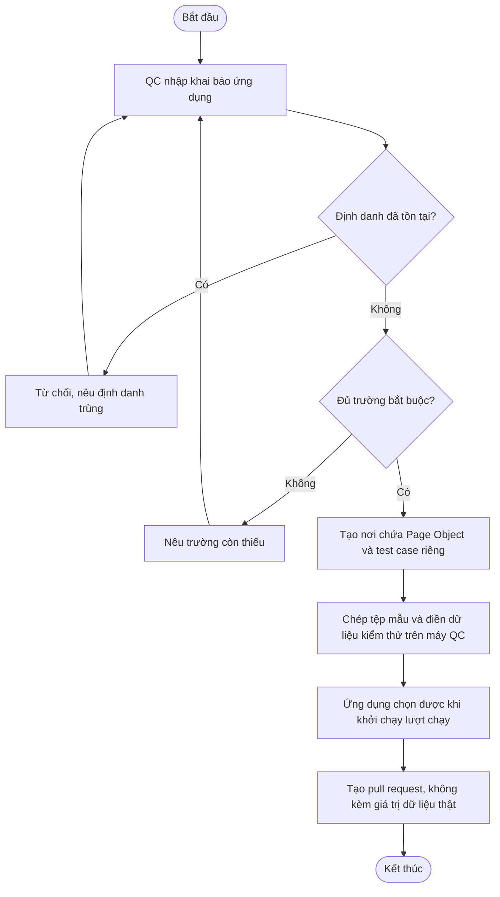
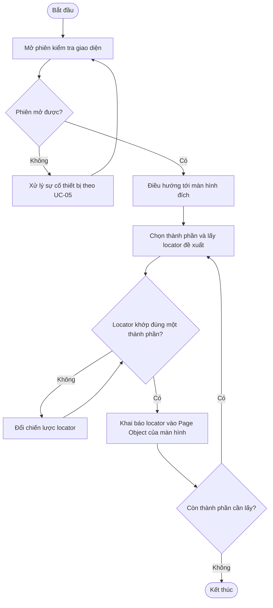
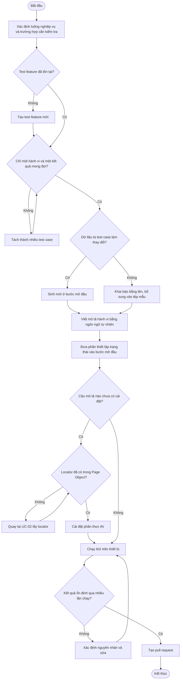
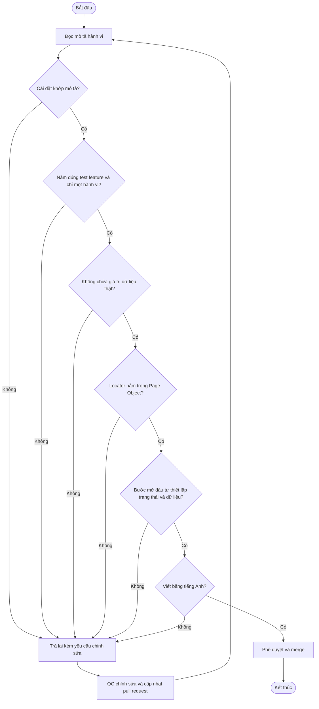
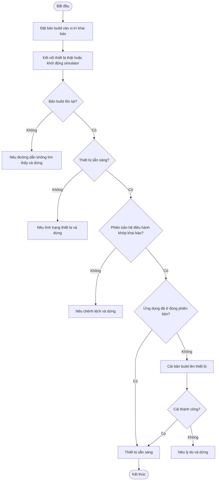
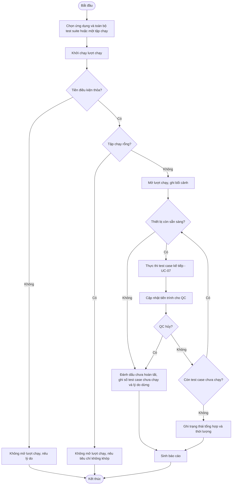
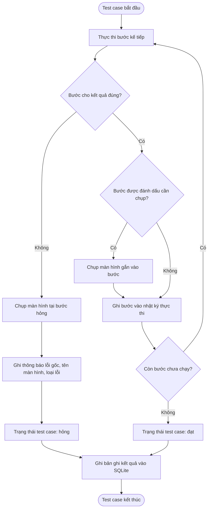
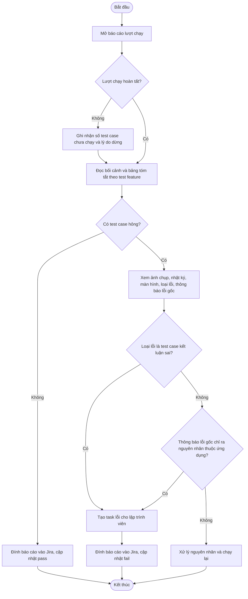
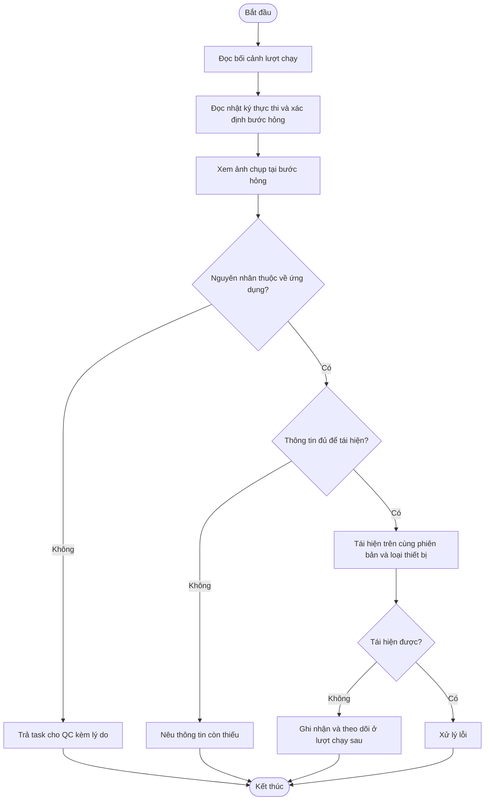

# Use Cases — Phase 1

Chín use case dưới đây phủ toàn bộ epic của Phase 1. Từ vựng trung tâm (test suite, test feature, test case, bước) định nghĩa ở `brd.md` §1.1.

| Use case | Epic | Actor chính |
|---|---|---|
| UC-01 | EP-24, EP-25 | QC |
| UC-02 | EP-01, EP-02 | QC |
| UC-03 | EP-03 | QC |
| UC-04 | EP-17 | Reviewer |
| UC-05 | EP-04 | QC |
| UC-06 | EP-05, EP-09 | QC |
| UC-07 | EP-06, EP-19 | Nền tảng |
| UC-08 | EP-07, EP-08 | QC |
| UC-09 | EP-23 | Lập trình viên |

---

## UC-01: Khai báo một ứng dụng vào nền tảng

**Actor:** QC
**Điều kiện tiên quyết:** Nền tảng đã cài đặt trên máy QC; QC có bản build của ứng dụng và biết thiết bị đích.

**Luồng chính:**
1. QC tạo khai báo cho ứng dụng: định danh ứng dụng, đường dẫn bản build, loại thiết bị đích, định danh thiết bị, phiên bản hệ điều hành đích.
2. QC tạo nơi chứa Page Object và test case riêng của ứng dụng.
3. QC chép tệp mẫu dữ liệu kiểm thử ra tệp cấu hình trên máy mình và điền giá trị cho từng mục (BR-017).
4. Nền tảng nhận biết ứng dụng và cho phép chọn ứng dụng này khi khởi chạy một lượt chạy.
5. QC tạo pull request cho khai báo mới và tệp mẫu, không kèm giá trị dữ liệu thật.

**Luồng thay thế:**
- 1a. Ứng dụng đã được khai báo trước đó: QC cập nhật bản build hoặc thiết bị đích trong khai báo hiện có thay vì tạo mới.
- 2a. Nền tảng đang có ứng dụng khác: ứng dụng mới được thêm vào bên cạnh, không ảnh hưởng test case và dữ liệu kết quả của ứng dụng đang có (BR-008).
- 3a. QC mới nhận máy đã có kho mã: QC chỉ thực hiện bước 3, dựa trên tệp mẫu để biết cần chuẩn bị những gì.

**Luồng ngoại lệ:**
- E1. Định danh ứng dụng trùng với một ứng dụng đã khai báo: nền tảng từ chối khai báo và nêu định danh đang bị trùng.
- E2. Khai báo thiếu trường bắt buộc: nền tảng nêu rõ trường thiếu; ứng dụng chưa dùng được cho tới khi bổ sung (BR-015).
- E3. Tệp cấu hình thiếu một mục dữ liệu mà tệp mẫu liệt kê: nền tảng nêu tên mục còn thiếu trước khi mở lượt chạy (FR-APP-04).

**Flowchart:**

---

## UC-02: Lấy locator và khai báo Page Object cho một màn hình

**Actor:** QC
**Điều kiện tiên quyết:** Ứng dụng đã khai báo (UC-01); bản build đã cài lên thiết bị (UC-05).

**Luồng chính:**
1. QC mở phiên kiểm tra giao diện tới ứng dụng trên thiết bị qua Appium Inspector.
2. QC điều hướng ứng dụng tới màn hình đích.
3. QC chọn từng thành phần cần thao tác và lấy locator đề xuất.
4. QC kiểm chứng locator trong Inspector: locator khớp đúng một thành phần.
5. QC khai báo locator vào Page Object của màn hình đó, đặt tên theo vai trò của thành phần trên màn hình.

**Luồng thay thế:**
- 3a. Thành phần không có định danh dùng được: QC chọn chiến lược locator khác theo thứ tự ưu tiên accessibility id, id, rồi tới predicate string hoặc class chain.
- 5a. Page Object của màn hình đã tồn tại: QC bổ sung locator vào Page Object đang có thay vì tạo mới (BR-007).

**Luồng ngoại lệ:**
- E1. Phiên kiểm tra giao diện không mở được: QC xử lý theo luồng ngoại lệ của UC-05 rồi thử lại.
- E2. Locator khớp nhiều thành phần hoặc không khớp thành phần nào: QC chọn chiến lược locator khác; locator chưa kiểm chứng không được đưa vào Page Object.
- E3. Màn hình đích không tới được vì cần dữ liệu kiểm thử chưa có: QC chuẩn bị dữ liệu theo BR-017 rồi thử lại.

**Flowchart:**

---

## UC-03: Soạn một test case mới

**Actor:** QC
**Điều kiện tiên quyết:** Ứng dụng đã khai báo; Page Object của các màn hình liên quan đã có locator (UC-02).

**Luồng chính:**
1. QC xác định luồng nghiệp vụ cần kiểm thử và trường hợp cụ thể cần kiểm tra, kèm kết quả mong đợi.
2. QC xác định test feature tương ứng với luồng nghiệp vụ đó; nếu chưa có thì tạo mới (BR-016).
3. QC xác định dữ liệu kiểm thử mà test case cần và phân loại theo BR-017: dữ liệu chỉ đọc thì khai báo bằng tên và bổ sung vào tệp mẫu; dữ liệu bị test case làm thay đổi hoặc tiêu thụ thì sinh mới ở bước mở đầu.
4. QC viết phần mô tả hành vi của test case bằng ngôn ngữ tự nhiên, theo góc nhìn người dùng, bằng tiếng Anh.
5. QC đưa vào bước mở đầu phần đưa ứng dụng và dữ liệu về trạng thái test case cần (BR-005).
6. QC cài đặt phần thực thi cho những câu mô tả chưa có sẵn, dùng locator từ Page Object.
7. QC chạy thử test case trên thiết bị và điều chỉnh cho tới khi kết quả ổn định qua nhiều lần chạy liên tiếp.
8. QC tạo pull request.

**Luồng thay thế:**
- 6a. Mọi câu mô tả đã có phần cài đặt: QC bỏ qua bước cài đặt (FR-AUTH-07).

**Luồng ngoại lệ:**
- E1. Test case cho kết quả khác nhau giữa các lần chạy liên tiếp: QC xác định nguyên nhân và sửa; test case không ổn định không được đưa vào pull request (NFR-03).
- E2. Test case đạt lần đầu và hỏng ở lần chạy thứ hai: dữ liệu đã bị chính test case tiêu thụ. QC chuyển mục dữ liệu đó sang loại sinh mới ở bước mở đầu (BR-017 quy tắc 3).
- E3. Locator cần dùng chưa có trong Page Object: QC quay lại UC-02.
- E4. Test case hỏng vì lỗi của ứng dụng: QC ghi nhận lỗi cho lập trình viên; test case vẫn được hoàn thiện và đưa vào bộ hồi quy.
- E5. Trường hợp cần kiểm tra chứa nhiều hành vi không liên quan nhau: QC tách thành nhiều test case trong cùng test feature (BR-016).

**Flowchart:**

---

## UC-04: Rà soát và phê duyệt test case

**Actor:** Reviewer
**Điều kiện tiên quyết:** Có pull request chứa test case mới hoặc test case đã sửa.

**Luồng chính:**
1. Reviewer đọc phần mô tả hành vi và đối chiếu với trường hợp mà test case tuyên bố kiểm tra.
2. Reviewer đối chiếu phần cài đặt với phần mô tả hành vi, xác nhận hai phần khớp nhau (BR-010).
3. Reviewer kiểm tra test case nằm đúng test feature tương ứng và chỉ kiểm tra một hành vi (BR-016).
4. Reviewer kiểm tra pull request không chứa giá trị dữ liệu kiểm thử thật, và mục dữ liệu mới đã được bổ sung vào tệp mẫu (BR-017).
5. Reviewer kiểm tra locator nằm trong Page Object và không nằm rải rác trong phần cài đặt (BR-007).
6. Reviewer kiểm tra test case tự đảm bảo điều kiện tiên quyết ở bước mở đầu, gồm cả dữ liệu bị tiêu thụ (BR-005, BR-017).
7. Reviewer phê duyệt và merge vào nhánh chính.

**Luồng thay thế:**
- 7a. Pull request chỉ chứa thay đổi khai báo ứng dụng hoặc Page Object: reviewer bỏ qua bước 1, 2 và 3.

**Luồng ngoại lệ:**
- E1. Phần cài đặt không khớp phần mô tả hành vi: reviewer trả lại kèm yêu cầu chỉnh sửa.
- E2. Test case trùng lặp với test case đã có: reviewer trả lại kèm chỉ dẫn tới test case đang có.
- E3. Pull request chứa tài khoản, mật khẩu hoặc giá trị dữ liệu thật: reviewer trả lại (BR-017).
- E4. Nội dung không viết bằng tiếng Anh: reviewer trả lại (BR-013).

**Flowchart:**

---

## UC-05: Chuẩn bị thiết bị và cài bản build

**Actor:** QC
**Điều kiện tiên quyết:** Ứng dụng đã khai báo; lập trình viên đã cung cấp bản build đã ký.

**Luồng chính:**
1. QC đặt bản build vào vị trí ghi trong khai báo ứng dụng.
2. QC kết nối thiết bị thật hoặc khởi động simulator theo khai báo.
3. Nền tảng kiểm tra thiết bị có mặt, kết nối được, và phiên bản hệ điều hành khớp khai báo.
4. Nền tảng cài bản build lên thiết bị.
5. Thiết bị ở trạng thái sẵn sàng cho một lượt chạy.

**Luồng thay thế:**
- 4a. Ứng dụng đã có trên thiết bị ở đúng phiên bản của bản build: bước cài được bỏ qua.

**Luồng ngoại lệ:**
- E1. Bản build không tồn tại ở vị trí khai báo: nền tảng nêu đường dẫn không tìm thấy và dừng (BR-015).
- E2. Thiết bị không có mặt, mất kết nối, hoặc đang khóa: nền tảng nêu tình trạng thiết bị và dừng.
- E3. Phiên bản hệ điều hành của thiết bị khác khai báo: nền tảng nêu chênh lệch và dừng.
- E4. Bản build không cài được lên thiết bị: nền tảng nêu lý do do hệ thống cài đặt trả về và dừng.

**Flowchart:**

---

## UC-06: Khởi chạy một lượt chạy và theo dõi tiến trình

**Actor:** QC
**Điều kiện tiên quyết:** Ứng dụng đã khai báo; test case đã merge vào nhánh chính; thiết bị sẵn sàng (UC-05); dữ liệu kiểm thử đã điền đầy đủ.

**Luồng chính:**
1. QC chọn ứng dụng và chạy toàn bộ test suite của nó.
2. QC khởi chạy lượt chạy.
3. Nền tảng kiểm tra tiền điều kiện theo BR-015 và mở lượt chạy, ghi nhận bối cảnh: định danh lượt chạy, thời điểm bắt đầu, ứng dụng, phiên bản ứng dụng, thiết bị, hệ điều hành.
4. Trước mỗi test case, nền tảng kiểm tra thiết bị còn sẵn sàng (BR-018), rồi thực thi test case đó và thu thập bằng chứng thực thi theo UC-07.
5. Nền tảng hiển thị tiến trình: test case đang chạy và test feature chứa nó, số test case đã hoàn tất trên tổng số, trạng thái từng test case đã hoàn tất.
6. Khi hết tập test case, nền tảng ghi trạng thái tổng hợp của lượt chạy, thời điểm kết thúc và tổng thời lượng (BR-011).
7. Nền tảng sinh báo cáo của lượt chạy.

**Luồng thay thế:**
- 1a. QC chọn một tập chạy theo test feature, theo tên test case, hoặc theo nhãn, thay vì toàn bộ test suite; trạng thái tổng hợp tính trên tập chạy đó (FR-RUN-02, BR-011).
- 4a. Một test case kết thúc ở trạng thái hỏng: nền tảng chuyển sang test case kế tiếp, không phụ thuộc loại lỗi (BR-002).

**Luồng ngoại lệ:**
- E1. Tiền điều kiện không thỏa, gồm cả trường hợp thiếu mục dữ liệu kiểm thử: lượt chạy không được mở, không sinh bản ghi kết quả và không sinh báo cáo; lý do được nêu theo từng mục không thỏa (BR-015, FR-APP-04).
- E2. Tập chạy được chọn rỗng: lượt chạy không được mở và nền tảng nêu tiêu chí chọn không khớp test case nào.
- E3. QC hủy lượt chạy giữa chừng: nền tảng giữ kết quả các test case đã hoàn tất, đánh dấu lượt chạy chưa hoàn tất, ghi số test case chưa chạy và lý do dừng, và vẫn sinh báo cáo (BR-012).
- E4. Kiểm tra ở bước 4 cho thấy thiết bị không còn sẵn sàng: lượt chạy dừng và xử lý như E3, với lý do dừng là thiết bị không còn sẵn sàng. Các test case chưa chạy không sinh bản ghi kết quả (BR-018).

**Flowchart:**

---

## UC-07: Thu thập bằng chứng thực thi cho một test case

**Actor:** Nền tảng
**Điều kiện tiên quyết:** Lượt chạy đang mở; thiết bị còn sẵn sàng; test case bắt đầu được thực thi.

**Luồng chính:**
1. Nền tảng thực thi từng bước của test case theo thứ tự trong phần mô tả hành vi.
2. Sau mỗi bước, nền tảng ghi vào nhật ký thực thi: nội dung câu mô tả của bước, kết quả bước, thời lượng bước.
3. Khi mọi bước cho kết quả đúng, nền tảng đặt trạng thái test case là `đạt`.
4. Nền tảng ghi một bản ghi kết quả cho test case, gồm bối cảnh lượt chạy, tên test feature và các trường ở FR-DATA-03, và lưu vào SQLite.

**Luồng thay thế:**
- 2a. Bước được đánh dấu tường minh là cần chụp: nền tảng chụp một ảnh màn hình và gắn vào bước đó (BR-003).
- 3a. Một bước hỏng: nền tảng chụp một ảnh màn hình tại thời điểm đó, ghi thông báo lỗi gốc, tên màn hình và loại lỗi theo BR-014, đặt trạng thái test case là `hỏng`, và không thực thi các bước còn lại.

**Luồng ngoại lệ:**
- E1. Việc chụp màn hình hoặc ghi nhật ký lỗi: trạng thái test case giữ nguyên, phần bằng chứng thiếu được đánh dấu là thiếu (BR-004).
- E2. Test case mất phiên điều khiển thiết bị giữa chừng: trạng thái là `hỏng` với loại lỗi "không thực hiện được bước"; nhật ký ghi thông báo lỗi gốc; ảnh chụp có thể thiếu và được đánh dấu là thiếu. Việc lượt chạy có tiếp tục hay không do BR-018 quyết định ở lần kiểm tra thiết bị kế tiếp.
- E3. Việc ghi bản ghi kết quả lỗi: nền tảng ghi nhận sự cố và tiếp tục lượt chạy; bản ghi bị thiếu không được tạo lại từ dữ liệu suy đoán.
- E4. Test case không được thực thi vì lượt chạy kết thúc bất thường: không sinh bản ghi kết quả; số lượng được ghi ở cấp lượt chạy (BR-012).

**Flowchart:**

---

## UC-08: Nhận báo cáo lượt chạy và cập nhật lên Jira

**Actor:** QC
**Điều kiện tiên quyết:** Một lượt chạy đã kết thúc và báo cáo đã được sinh.

**Luồng chính:**
1. QC mở báo cáo của lượt chạy.
2. QC đọc phần bối cảnh và bảng tóm tắt theo test feature: tổng số test case, số lượng theo từng trạng thái, thời lượng.
3. QC xem chi tiết từng test case hỏng: ảnh chụp bước hỏng, nhật ký thực thi, tên màn hình, loại lỗi và thông báo lỗi gốc.
4. QC đính báo cáo vào task Jira tương ứng và cập nhật trạng thái pass/fail.

**Luồng thay thế:**
- 3a. Không có test case hỏng: QC bỏ qua bước 3.
- 4a. Test case hỏng với loại lỗi "test case kết luận sai": QC tạo task lỗi cho lập trình viên kèm phần báo cáo tương ứng (UC-09).
- 4b. Test case hỏng với loại lỗi "không thực hiện được bước": QC đọc thông báo lỗi gốc để xác định nguyên nhân thuộc về ứng dụng, test case, dữ liệu kiểm thử hay thiết bị, rồi tạo task lỗi hoặc tự xử lý và chạy lại (BR-014).

**Luồng ngoại lệ:**
- E1. Báo cáo thuộc một lượt chạy chưa hoàn tất: báo cáo nêu rõ số test case chưa chạy và lý do dừng; QC không dùng lượt chạy này làm kết quả hồi quy đầy đủ (BR-012).
- E2. Báo cáo thiếu ảnh chụp của một test case hỏng: báo cáo nêu rõ phần bằng chứng thiếu; QC dựa trên nhật ký thực thi để đánh giá (BR-004).

**Flowchart:**

---

## UC-09: Điều tra một test case hỏng từ báo cáo

**Actor:** Lập trình viên
**Điều kiện tiên quyết:** Có task Jira kèm báo cáo của lượt chạy chứa test case hỏng.

**Luồng chính:**
1. Lập trình viên đọc bối cảnh lượt chạy: phiên bản ứng dụng, thiết bị, phiên bản hệ điều hành, thời điểm chạy.
2. Lập trình viên đọc nhật ký thực thi để biết test case đã đi qua những bước nào và hỏng ở bước nào.
3. Lập trình viên xem ảnh chụp màn hình tại bước hỏng để biết trạng thái ứng dụng lúc đó.
4. Lập trình viên đọc tên màn hình, loại lỗi và thông báo lỗi gốc để khoanh vùng nguyên nhân.
5. Lập trình viên tái hiện lỗi trên cùng phiên bản và cùng loại thiết bị, rồi xử lý.

**Luồng thay thế:**
- 5a. Nguyên nhân không thuộc về ứng dụng: lập trình viên trả task lại cho QC kèm lý do.

**Luồng ngoại lệ:**
- E1. Nhật ký thực thi không đủ để tái hiện: lập trình viên nêu thông tin còn thiếu; yêu cầu này được ghi lại để bổ sung vào nội dung nhật ký.
- E2. Lỗi không tái hiện được trên cùng bối cảnh: lập trình viên ghi nhận và theo dõi ở các lượt chạy sau; test case được đánh dấu để theo dõi độ ổn định.

**Flowchart:**

