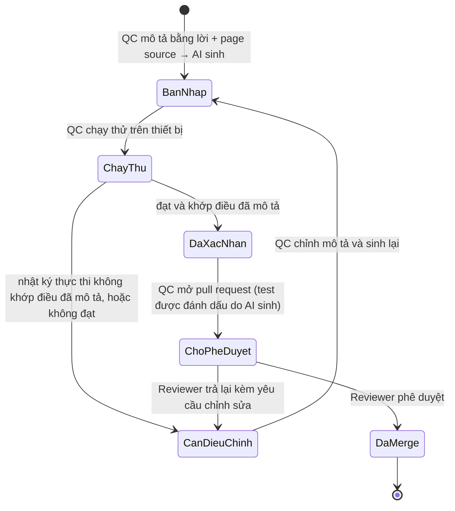

# Business Rules — Phase 2

Phase 2 bổ sung AI vào nền tảng. Nền tảng dùng AI bằng cách **chủ động gọi một AI CLI bên ngoài (như Claude Code)** tại các điểm cần AI — không nhúng khóa API, không tự quản nhà cung cấp AI. Tài liệu đặc tả ba phần: **tự phục hồi locator** (BR-201→210), **sinh test case** (BR-211→218), và **cách dùng AI CLI cùng môi trường** (BR-219→221).

Từ vựng trung tâm (test suite, test feature, test case, bước, bằng chứng thực thi, lượt chạy) định nghĩa ở `brd.md` §1.1.

Một **lần tự phục hồi** là một sự việc trong một lượt chạy: một lần tìm phần tử theo locator dự kiến thất bại, nền tảng nhờ AI tìm một cách khác để định vị phần tử đó. Đây là thực thể trung tâm của phần tự phục hồi.

---

## State diagram — vòng đời một lần tự phục hồi

```mermaid
stateDiagram-v2
[*] --> DangThuPhucHoi: đang chạy, locator không tìm thấy (AI đang bật)
DangThuPhucHoi --> DaApDung: tìm được phần tử trong giới hạn số lần thử → dùng, test chạy tiếp
DangThuPhucHoi --> KhongPhucHoiDuoc: AI CLI lỗi, hoặc hết số lần thử mà không tìm được
KhongPhucHoiDuoc --> [*]: bước hỏng như Phase 1
DaApDung --> [*]: ghi vào báo cáo (locator cũ→mới + ảnh); test chạy tiếp
```

Ghi chú đọc sơ đồ:
- Cả sơ đồ xảy ra trong lượt chạy; test chạy tiếp ngay, không dừng chờ người. Lần tự phục hồi kết thúc ở việc được ghi vào báo cáo.
- Sau lượt chạy, con người xem báo cáo và — nếu AI đoán đúng — tự cập nhật locator vào Page Object rồi mở pull request. Nền tảng không tạo pull request (BR-203, BR-210).
- Trạng thái đạt/hỏng của test case không nằm trong sơ đồ này — nó do các phép kiểm quyết định, độc lập với lần tự phục hồi (BR-204).

---

## BR-201: Điều kiện kích hoạt tự phục hồi
- Quy tắc: Tự phục hồi chỉ kích hoạt khi một lần tìm phần tử theo locator dự kiến thất bại (không tìm thấy) và AI đang bật cho app đó. Không kích hoạt ở mọi lần tìm phần tử.
- Lý do: Gọi AI ở mọi lần tìm phần tử làm tăng chi phí và độ trễ toàn lượt chạy (NFR-05).
- Nếu vi phạm: Chi phí và thời lượng lượt chạy tăng ngoài kiểm soát.
- Áp dụng cho: UC-201.

## BR-202: Số lần thử phục hồi cho một locator hỏng
- Quy tắc: Với mỗi locator hỏng trong một lượt chạy, nền tảng thử phục hồi tối đa một số lần giới hạn (đặt trong cấu hình của app; mặc định 3). Mỗi lần thử là một lời gọi AI. Nếu locator thay thế trả về không tìm thấy phần tử, nền tảng thử lại cho tới hết giới hạn. Khi tìm được phần tử thì dừng thử và dùng phần tử đó; hết giới hạn mà chưa được thì bước hỏng như Phase 1. Locator đã phục hồi được dùng lại trong cùng lượt chạy cho chính locator đó, không thử lại.
- Lý do: Cho vài lần thử để tăng khả năng phục hồi khi AI đoán trượt lần đầu; giới hạn số lần để kiểm soát chi phí và độ trễ (NFR-05).
- Nếu vi phạm: Thử không giới hạn làm chi phí và thời lượng lượt chạy tăng ngoài kiểm soát.
- Áp dụng cho: UC-201.

## BR-203: Locator do tự phục hồi chỉ vào nhánh chính qua pull request được duyệt
- Quy tắc: Nền tảng KHÔNG tự sửa file, không đụng git, không tạo pull request. Trong lúc chạy, locator thay thế dùng tạm trong bộ nhớ để lượt chạy đi tiếp. Locator chỉ vào **nhánh chính** (bộ test case đã tin cậy) khi con người tự cập nhật vào Page Object và mở một pull request được duyệt.
- Lý do: Khi tự phục hồi giữa một lượt chạy, không ai kiểm được ngay lúc đó AI có bấm trúng phần tử đúng không — bám nhầm thì test đạt giả. Người rà soát (nhìn ảnh phần tử AI đã bấm) là chỗ kiểm điều đó. Mọi thay đổi code vào nhánh chính đều qua pull request được duyệt, dù do người hay AI (BC-08); một lượt chạy hồi quy cũng không được tự sửa chính bộ test đang chạy (NFR-03).
- Nếu vi phạm: Một locator AI bấm nhầm tự đóng băng vào bộ test tin cậy, làm các lượt sau đạt giả mà không ai kiểm.
- Áp dụng cho: UC-201.

## BR-204: Kết quả chức năng độc lập với tự phục hồi
- Quy tắc: Kết luận đạt hoặc hỏng của một test case do các phép kiểm (assertion) quyết định, không phụ thuộc việc có tự phục hồi hay không. "Đạt kèm tự phục hồi" là một nhãn dẫn xuất gắn khi test case đạt và có ít nhất một lần tự phục hồi, không phải một kết luận thứ ba.
- Lý do: Tự phục hồi là cơ chế phụ trợ để test không dừng giữa chừng, không phải một mức chất lượng thấp hơn của kết quả.
- Nếu vi phạm: Test đúng chức năng bị đánh dấu như kết quả kém, hoặc một lần tự phục hồi bị bỏ qua khỏi kết quả.
- Áp dụng cho: UC-201.

## BR-205: Ghi nhận mọi lần tự phục hồi
- Quy tắc: Mỗi lần tự phục hồi được ghi nhận riêng, gồm: locator dự kiến, locator thay thế đã dùng, màn hình (Page Object) đang thao tác, bước, và thời điểm. Ghi nhận áp dụng kể cả khi test case cuối cùng hỏng.
- Lý do: Một lần tự phục hồi có thể xảy ra nhiều lần trong một test case; và một lần sửa sai có thể chính là nguyên nhân test case hỏng — con người cần thấy đầy đủ từng lần.
- Nếu vi phạm: Con người thiếu thông tin để biết AI đoán đúng hay sai.
- Áp dụng cho: UC-201.

## BR-206: Mỗi lần tự phục hồi đều hiển thị trong báo cáo, kèm ảnh
- Quy tắc: Mỗi lần tự phục hồi đã áp dụng được ghi và hiển thị trong file báo cáo HTML của lượt chạy, **kèm ảnh chụp phần tử mà nền tảng đã thao tác**, để con người xem lại và biết AI bấm trúng thứ cần hay không. Test chạy tiếp ngay khi tự phục hồi, không dừng chờ người; việc xem diễn ra sau khi lượt chạy kết thúc. Không lần tự phục hồi nào bị bỏ khỏi báo cáo.
- Lý do: Rủi ro lớn nhất của tự phục hồi là bám nhầm một phần tử tương tự nhưng sai, làm test báo đạt trong khi ứng dụng đã hỏng (đạt giả). Việc hiển thị đầy đủ trong báo cáo là cơ chế đưa con người vào để chặn rủi ro này (NFR-06).
- Nếu vi phạm: Một lần bám nhầm phần tử lọt qua mà không ai biết.
- Áp dụng cho: UC-201.

## BR-207: Không sửa lại bản ghi lượt chạy đã qua
- Quy tắc: Việc cập nhật (hay không cập nhật) locator vào Page Object sau khi xem một lần tự phục hồi không làm thay đổi bản ghi kết quả của lượt chạy đã qua.
- Lý do: Bản ghi kết quả là sự thật lịch sử của một thời điểm và là nền cho phân tích xu hướng (Phase 4). Trạng thái "đạt kèm tự phục hồi" tự nó đã báo cần chú ý.
- Nếu vi phạm: Lịch sử kết quả bị viết lại, làm sai phân tích xu hướng.
- Áp dụng cho: UC-201.

## BR-208: Ứng xử khi không phục hồi được
- Quy tắc: Nếu AI tắt cho app, AI CLI không phản hồi hoặc lỗi, hoặc hết số lần thử mà không tìm được locator thay thế dùng được, thì không có tự phục hồi; bước hỏng đúng như Phase 1 (ghi nhận hỏng, chụp ảnh tại bước hỏng, chạy tiếp test case kế). Lỗi khi gọi AI không làm dừng lượt chạy và không tự biến kết quả test case.
- Lý do: Tự phục hồi là thứ phụ trợ, không phải thứ đang được kiểm tra; sự cố của nó không được đổi kết luận về ứng dụng.
- Nếu vi phạm: Sự cố hạ tầng AI bị tính thành lỗi của ứng dụng, hoặc làm dừng cả lượt chạy.
- Áp dụng cho: UC-201.

## BR-209: Bật hoặc tắt AI theo từng app
- Quy tắc: Việc gọi AI bật hoặc tắt được theo từng app qua cấu hình của app. App tắt AI chạy đúng như Phase 1.
- Lý do: Kiểm soát chi phí và độ trễ (NFR-05); đồng thời cho phép tắt AI với app có màn hình chứa dữ liệu nhạy cảm (AS-02).
- Nếu vi phạm: Không tắt được gọi AI khi cần kiểm soát chi phí hoặc khi màn hình có dữ liệu nhạy cảm.
- Áp dụng cho: UC-201.

## BR-210: Con người cập nhật locator và mở pull request; nền tảng không đụng git
- Quy tắc: Nền tảng KHÔNG tự sửa file hay tạo pull request. Sau khi xem một lần tự phục hồi trong báo cáo (locator cũ→mới kèm ảnh), con người (QC automation) — nếu thấy AI đoán đúng — cập nhật locator vào Page Object và mở pull request theo quy trình git bình thường; nếu AI đoán nhầm thì điền locator đúng. Nếu AI bấm nhầm, kết quả "đạt kèm tự phục hồi" của lượt chạy đó không đáng tin và cần xem lại; bản ghi lượt chạy vẫn giữ nguyên (BR-207).
- Lý do: Việc git/commit/tạo pull request do con người làm sau khi review kỹ (quyết định cho hướng B); nền tảng giữ mỏng, không đụng git. Mọi thay đổi vào nhánh chính đi qua pull request được duyệt (BC-08).
- Nếu vi phạm: Nền tảng tự đụng git hoặc tự tạo pull request — sai tiền đề hướng B; hoặc locator vào nhánh chính không qua rà soát.
- Áp dụng cho: UC-201.

---

# Phần sinh test case

Thực thể trung tâm của phần này là một **test case do AI sinh**. Vòng đời của nó từ lúc AI sinh tới lúc vào nhánh chính như dưới đây.

## State diagram — vòng đời một test case do AI sinh

## BR-211: Đầu vào của việc sinh test case
- Quy tắc: AI sinh test case từ mô tả bằng lời của QC và page source của màn hình đích.
- Lý do: Đây là hai đầu vào QC có được mà không cần viết code (EP-11).
- Nếu vi phạm: Thiếu một trong hai đầu vào thì test case sinh ra không bám đúng màn hình hoặc không đúng ý QC.
- Áp dụng cho: UC-203.

## BR-212: Đầu ra là test case đầy đủ hai phần, ưu tiên tái dùng
- Quy tắc: Kết quả sinh gồm phần mô tả hành vi bằng ngôn ngữ tự nhiên và phần cài đặt; locator đặt trong Page Object. Việc sinh ưu tiên tái dùng câu mô tả hành vi và phần cài đặt đã có, không tạo câu trùng nghĩa mới.
- Lý do: Sinh câu trùng nghĩa làm phần cài đặt phình lên với các câu trùng và phá tính nhất quán của test suite.
- Nếu vi phạm: Phần cài đặt đầy các câu trùng nghĩa, khó bảo trì.
- Áp dụng cho: UC-203.

## BR-213: Test case do AI sinh là bản nháp
- Quy tắc: Test case do AI sinh là bản nháp, không phải bản cuối. QC xác nhận trước khi đưa đi rà soát.
- Lý do: LLM có thể sinh hành vi không được yêu cầu, hoặc bám locator sai mà bước vẫn chạy qua; đầu ra phải được con người kiểm.
- Nếu vi phạm: Một test case sai hoặc thừa đi thẳng vào rà soát mà chưa ai kiểm.
- Áp dụng cho: UC-203.

## BR-214: Xác nhận qua mô tả hành vi, không qua cài đặt
- Quy tắc: QC xác nhận một test case do AI sinh bằng cách đọc phần mô tả hành vi và chạy thử, đối chiếu nhật ký thực thi với điều mình đã mô tả — không cần đọc phần cài đặt.
- Lý do: Từ Phase 2, QC thao tác được mà không cần đọc hay viết phần cài đặt (NFR-08); phần mô tả hành vi phải khớp với hành vi được thực thi (NFR-09).
- Nếu vi phạm: QC buộc phải đọc cài đặt để tin test case, mất lợi ích xác nhận nhanh qua mô tả hành vi.
- Áp dụng cho: UC-203.

## BR-215: Chạy xanh trước khi mở pull request
- Quy tắc: Một test case do AI sinh phải chạy được trên thiết bị ít nhất một lần và đạt trước khi QC mở pull request.
- Lý do: Chặn test case sai hoặc không chạy được tràn vào hàng đợi rà soát và làm mất thời gian Reviewer.
- Nếu vi phạm: Reviewer nhận những test case chưa từng chạy được.
- Áp dụng cho: UC-203.

## BR-216: Đánh dấu test case do AI sinh
- Quy tắc: Test case do AI sinh được đánh dấu rõ là do AI sinh, để Reviewer phân biệt với test case do người viết khi rà soát.
- Lý do: Reviewer cần biết để rà soát kỹ hơn phần AI sinh; đây là điều kiện để đo tỷ lệ pull request AI sinh được duyệt (SM-06).
- Nếu vi phạm: Reviewer không phân biệt được nguồn gốc test case khi rà soát.
- Áp dụng cho: UC-203.

## BR-217: Quyền chấp nhận test case thuộc về con người
- Quy tắc: AI không tự đưa test case vào nhánh chính. Mọi test case, dù do AI sinh hay người viết, vào nhánh chính qua pull request được phê duyệt.
- Lý do: Quyền chấp nhận test case thuộc về con người (NFR-06); mọi thay đổi vào nhánh chính đi qua pull request (BC-08).
- Nếu vi phạm: Test case do AI sinh vào nhánh chính mà không qua rà soát.
- Áp dụng cho: UC-203.

## BR-218: Sinh test case là hành động chủ động, chịu công tắc bật/tắt AI
- Quy tắc: Việc gọi AI để sinh test case do QC chủ động khởi động, không diễn ra trong lúc chạy test. Việc gọi này chịu cùng công tắc bật/tắt AI theo app (BR-209): app tắt AI không sinh được test case qua AI, QC soạn tay như Phase 1.
- Lý do: Kiểm soát chi phí và độ trễ (NFR-05); giữ một chỗ bật/tắt AI duy nhất cho mỗi app.
- Nếu vi phạm: Gọi AI sinh test case ngoài tầm kiểm soát chi phí, hoặc bỏ qua công tắc bật/tắt AI.
- Áp dụng cho: UC-203.

---

# Cách nền tảng dùng AI CLI và môi trường

Nền tảng không nhúng khóa API và không tự quản nhà cung cấp AI. Tại các điểm cần AI (tự phục hồi, sinh test case), nền tảng **chủ động gọi một AI CLI bên ngoài** — giai đoạn này là Claude Code. Không có giao diện cấu hình AI; xem báo cáo vẫn qua dòng lệnh và mở file HTML như Phase 1.

## BR-219: Nền tảng gọi AI qua một AI CLI bên ngoài
- Quy tắc: Mọi lời gọi AI của nền tảng thực hiện bằng cách gọi một AI CLI bên ngoài (Claude Code), đưa đầu vào cần thiết và nhận kết quả. Khi tự phục hồi, công cụ chỉ trả về một locator thay thế; nền tảng không để nó tự sửa file lúc chạy. Nền tảng không nhúng khóa API, không lưu và không quản danh sách nhà cung cấp AI.
- Lý do: Tận dụng một AI CLI sẵn có trên máy (chi phí theo thuê bao), tránh phải tự xây và bảo trì lớp gọi AI cùng cơ chế quản khóa và nhà cung cấp.
- Nếu vi phạm: Nền tảng ôm lại gánh nặng quản khóa và nhà cung cấp mà hướng B muốn bỏ.
- Áp dụng cho: UC-201, UC-203.

## BR-220: Xác thực AI CLI bằng token trong môi trường, ngoài kho mã
- Quy tắc: AI CLI được xác thực bằng một token (lấy một lần qua bước cài đặt) lưu ngoài kho mã, không theo dõi bởi Git. Nền tảng không giữ khóa API riêng.
- Lý do: Token theo thuê bao rẻ hơn khóa tính theo lượt gọi; giữ bí mật ngoài kho mã để không đẩy lên Git.
- Nếu vi phạm: Token lộ lên Git, hoặc mất lợi thế chi phí của thuê bao.
- Áp dụng cho: UC-205.

## BR-221: Mỗi máy phải có AI CLI và token trước khi dùng tính năng AI
- Quy tắc: Máy chạy nền tảng phải cài AI CLI và có token hợp lệ trước khi dùng tự phục hồi hoặc sinh test case. Nền tảng cung cấp một bước **cài đặt** (chọn CLI → cài hoặc kiểm → hướng dẫn lấy token một lần → lưu token ngoài kho mã) và một bước **kiểm tra tình trạng** (kiểm CLI có mặt và token hợp lệ). Nếu thiếu, các tính năng AI không chạy (như khi AI tắt); phần chạy test không dùng AI vẫn hoạt động.
- Lý do: AI CLI là phụ thuộc bên ngoài của môi trường (như bộ công cụ chạy iOS); phải có sẵn thì tính năng AI mới chạy được.
- Nếu vi phạm: Tính năng AI hỏng khó hiểu vì thiếu CLI hoặc token mà không được báo sớm.
- Áp dụng cho: UC-205.
