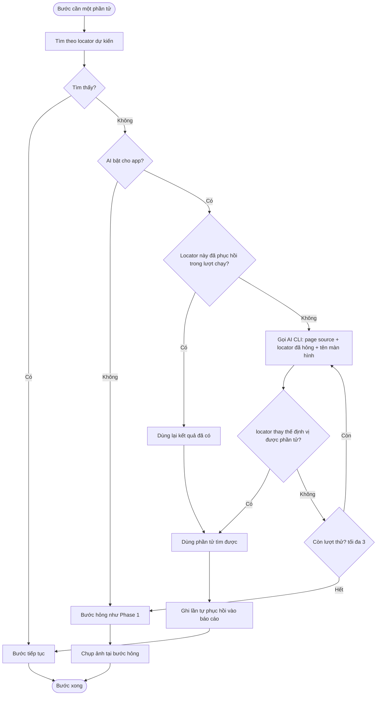
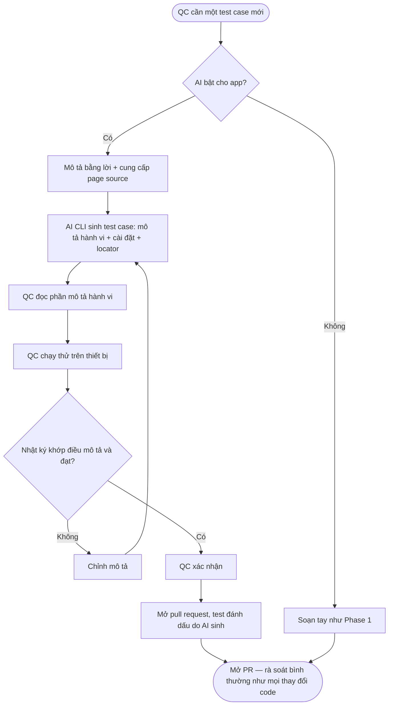
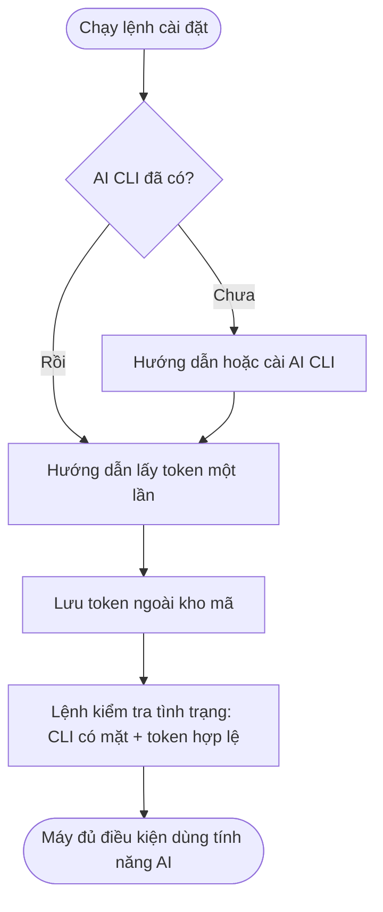

# Use Cases — Phase 2

Ba phần: tự phục hồi locator (UC-201), sinh test case (UC-203), và cài đặt AI CLI trên máy (UC-205).

Rà soát pull request là quy trình bình thường ngoài nền tảng (BC-08), không phải use case của nền tảng. Việc nền tảng làm được đặc tả bằng yêu cầu và quy tắc, không phải use case: đánh dấu test do AI sinh (FR-GEN-05, BR-216); và với tự phục hồi, ghi locator cũ→mới kèm ảnh vào báo cáo (FR-HEAL-05, FR-HEAL-07). Con người tự cập nhật Page Object và mở pull request; nền tảng không tạo pull request. Việc mở và duyệt pull request là quy trình git bình thường bên ngoài.

Từ vựng trung tâm định nghĩa ở `brd.md` §1.1. Quy tắc nghiệp vụ ở `business-rules.md` Phase 2.

---

## UC-201: Tự phục hồi một locator hỏng lúc chạy

**Actor:** QC (người khởi chạy lượt chạy); nền tảng thực hiện tự phục hồi trong lúc chạy.

**Điều kiện tiên quyết:**
- Một lượt chạy đang thực thi một test case.
- Một bước cần thao tác với một phần tử theo locator dự kiến.

(Luồng chính là trường hợp AI đang bật cho app; AI tắt là luồng ngoại lệ E1.)

**Luồng chính:**
1. Nền tảng tìm phần tử theo locator dự kiến.
2. Không tìm thấy phần tử.
3. Nền tảng gọi AI CLI (chỉ để lấy locator) đưa page source hiện tại, locator đã hỏng và tên màn hình để AI suy ra phần tử cần tìm (BR-201).
4. AI CLI trả về một locator thay thế định vị.
5. Nền tảng tìm được phần tử theo locator thay thế đó.
6. Bước tiếp tục với phần tử tìm được.
7. Nền tảng ghi một lần tự phục hồi vào báo cáo (locator dự kiến, locator thay thế đã dùng, màn hình, bước, thời điểm) (BR-205, BR-206).
8. Test case chạy tới hết; kết luận đạt/hỏng do các phép kiểm quyết định. Test case đạt có lần tự phục hồi được gắn nhãn "đạt kèm tự phục hồi" (BR-204).

**Luồng thay thế:**
- 2a. Cùng locator này đã được phục hồi trước đó trong lượt chạy: nền tảng dùng lại kết quả đã có, không gọi AI lần nữa (BR-202).
- 4a. Locator thay thế AI trả về không tìm thấy phần tử: nền tảng gọi lại AI CLI, thử tối đa số lần cấu hình được (mặc định 3) (BR-202).
- 8a. Test case cuối cùng hỏng dù đã có tự phục hồi: các lần tự phục hồi vẫn được ghi vào báo cáo (BR-205); trạng thái test case là hỏng.

**Luồng ngoại lệ:**
- E1. AI tắt cho app: không gọi AI; bước hỏng như Phase 1 (BR-208).
- E2. AI CLI không phản hồi hoặc lỗi: không có tự phục hồi; bước hỏng như Phase 1; lỗi gọi AI CLI không làm dừng lượt chạy (BR-208).
- E3. Sau khi hết số lần thử, AI vẫn không đưa được locator thay thế định vị được phần tử: không có tự phục hồi; bước hỏng như Phase 1 (BR-202, BR-208).

**Flowchart:**

---

## UC-203: Soạn một test case mới với hỗ trợ AI

**Actor:** QC.

**Điều kiện tiên quyết:**
- AI đang bật cho app (BR-209).
- QC có page source của màn hình đích (lấy qua Appium Inspector hoặc nền tảng).

**Luồng chính:**
1. QC mô tả trường hợp cần kiểm thử bằng lời và cung cấp page source của màn hình đích (BR-211).
2. Nền tảng gọi AI CLI sinh test case: phần mô tả hành vi + phần cài đặt, locator vào Page Object, ưu tiên tái dùng câu và phần cài đặt đã có (BR-212).
3. QC đọc phần mô tả hành vi của test case (BR-214).
4. QC chạy thử test case trên thiết bị.
5. QC đối chiếu nhật ký thực thi với điều mình đã mô tả.
6. Nhật ký khớp và test case đạt: QC xác nhận (BR-213).
7. QC mở pull request; test case được đánh dấu là do AI sinh (BR-215, BR-216).
8. Pull request đi qua rà soát và phê duyệt bình thường như mọi thay đổi code (BC-08).

**Luồng thay thế:**
- 5a. Nhật ký không khớp điều đã mô tả, hoặc test case không đạt: QC chỉnh mô tả và yêu cầu sinh lại (quay lại bước 2) (BR-213).

**Luồng ngoại lệ:**
- E1. AI tắt cho app: không sinh được test case qua AI; QC soạn tay như Phase 1 (BR-218).
- E2. AI CLI không phản hồi hoặc lỗi: không sinh được lần này; QC thử lại hoặc soạn tay.

**Flowchart:**

---

## UC-205: Cài đặt AI CLI và token trên máy

**Actor:** QC automation (người vận hành máy).

**Điều kiện tiên quyết:**
- Máy đã có nền tảng; chưa cài AI CLI hoặc chưa có token.

**Luồng chính:**
1. Người dùng chạy lệnh cài đặt của nền tảng.
2. Nền tảng kiểm AI CLI đã có chưa; nếu chưa, hướng dẫn hoặc tiến hành cài (BR-221).
3. Nền tảng hướng dẫn lấy token một lần từ AI CLI.
4. Người dùng lấy token; nền tảng lưu ngoài kho mã (BR-220).
5. Người dùng chạy lệnh kiểm tra tình trạng; nền tảng xác nhận AI CLI có mặt và token hợp lệ (BR-221).

**Luồng thay thế:**
- 2a. AI CLI đã có sẵn: bỏ qua bước cài, sang lấy token.

**Luồng ngoại lệ:**
- E1. Thiếu AI CLI hoặc token khi chạy tính năng AI: nền tảng báo rõ ở bước kiểm tra tình trạng; tính năng AI không chạy, phần chạy test không dùng AI vẫn hoạt động (BR-221).

**Flowchart:**

